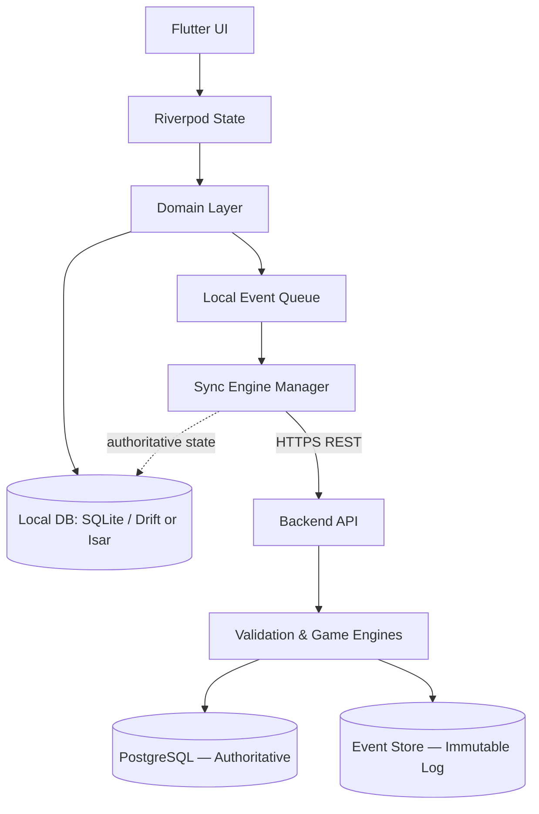
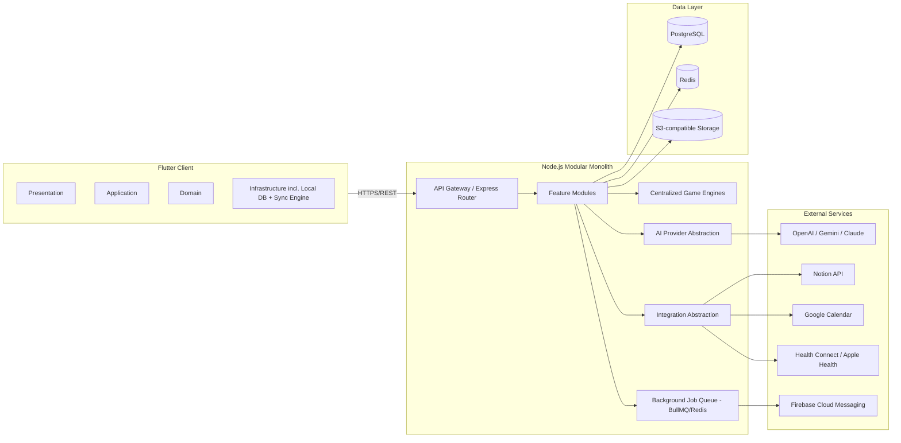
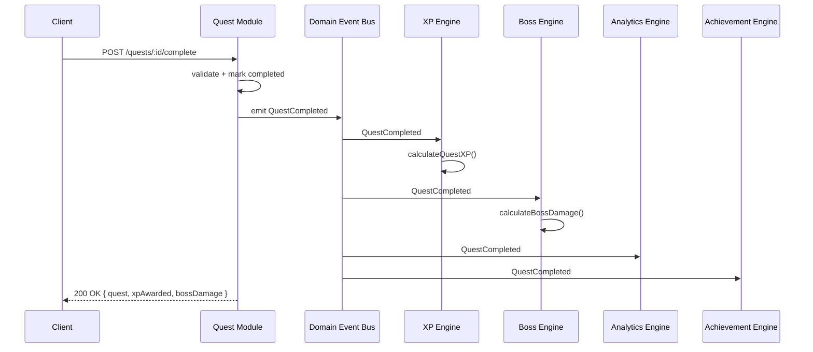
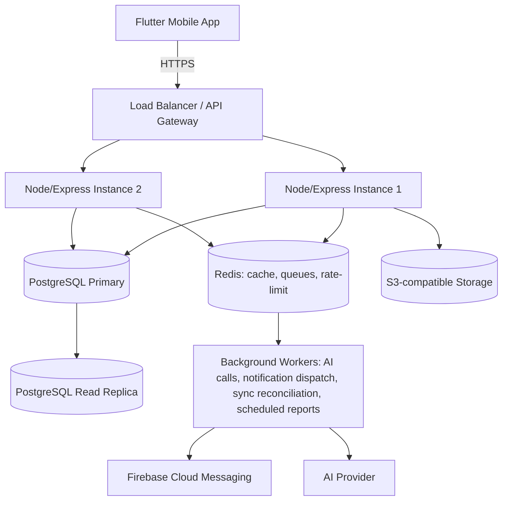
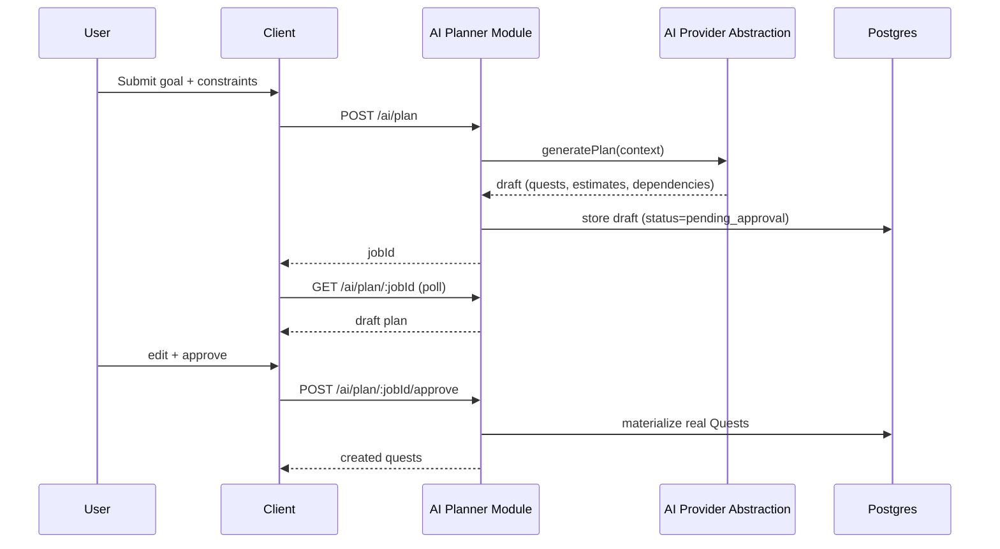
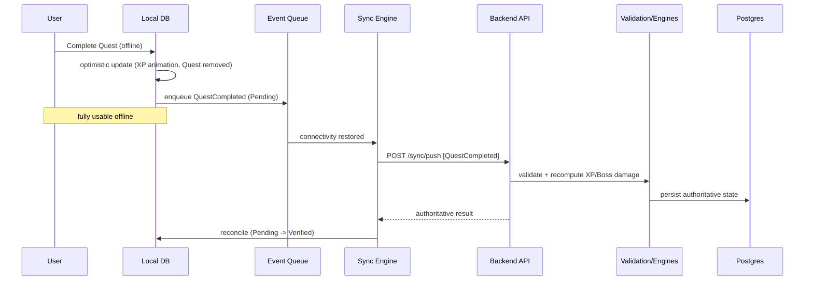
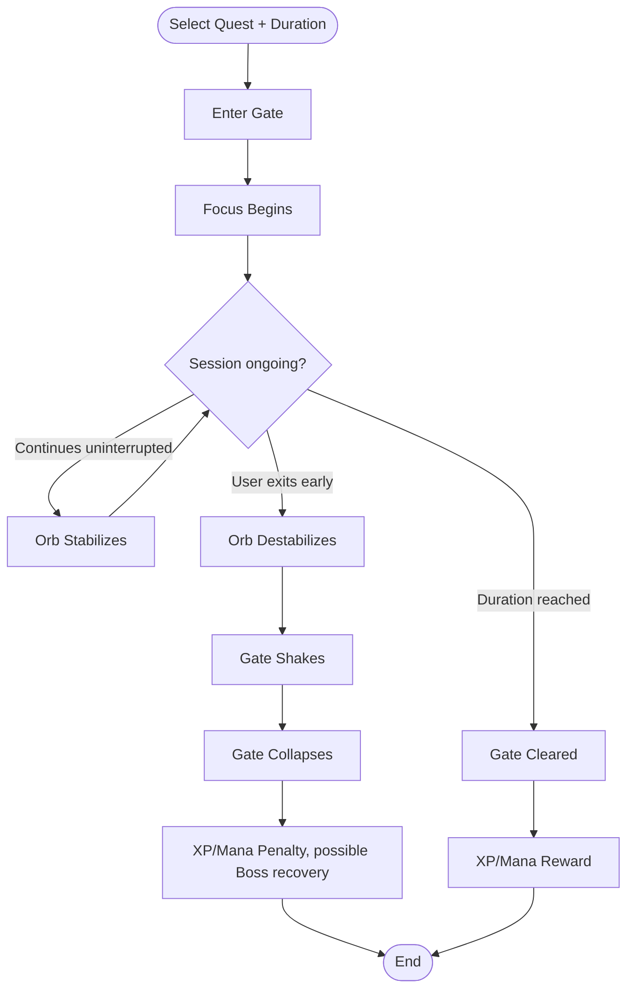
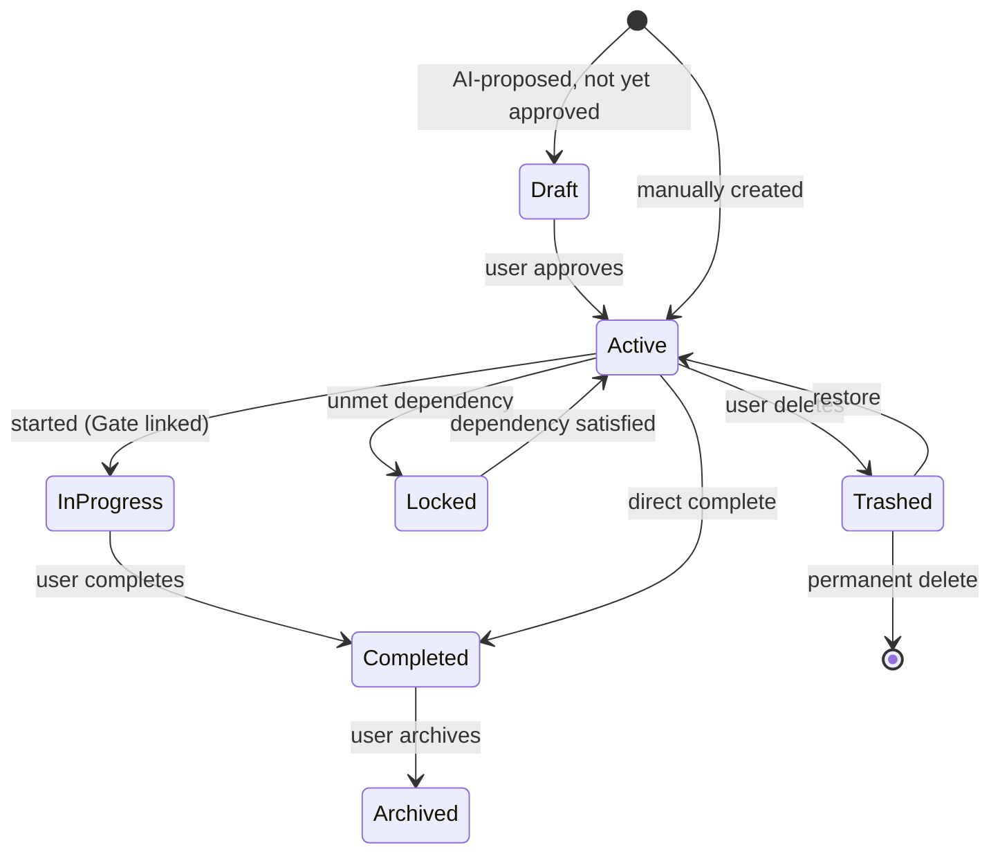
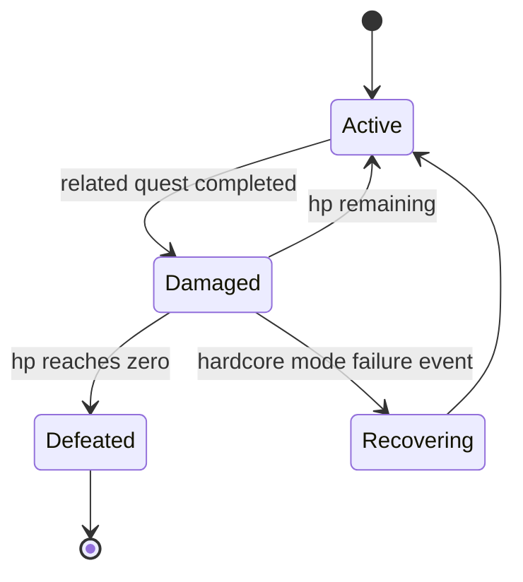

---

## 3. System Architecture

### 3.1 Architectural Style

ARISE combines: **Modular Monolith** (deployment/ownership boundary) + **Clean Architecture** (dependency direction within each module) + **Feature-First organization** (physical folder structure) + **Lightweight Domain-Driven Design** (framework-independent domain models) + **Repository Pattern** (storage abstraction) + **Event-Driven communication between modules** + **Offline-First / Local-First client architecture**. This combination is chosen specifically because the team is a solo/small developer transitioning off AI-assisted "vibe coding" into manual maintenance — it minimizes operational complexity (one deployable) while maximizing the odds that any single feature can be understood, replaced, or rewritten in isolation.

### 3.2 Offline-First / Local-First Model

The local database is the **primary runtime data source**; the backend is the **authoritative source of truth**, not the primary runtime database. The frontend never blocks its UI on a network round-trip for normal interactions. Internet connectivity is required only for: AI features, initial authentication, cloud synchronization, external integrations, remote backups, and push notifications. Every other interaction — creating, completing, editing, deleting, nesting, and organizing Quests, Habits, Notes, Gate sessions, and Reminders — MUST function fully offline.



### 3.3 High-Level Component Diagram



### 3.4 Frontend Architecture (per feature)

```
frontend/lib/features/<feature>/
  presentation/     -- widgets, screens, view-models (Riverpod providers/notifiers)
  application/       -- use-case orchestration, DTO <-> domain mapping
  domain/             -- pure Dart entities & value objects, no Flutter/HTTP/DB imports
  infrastructure/     -- local DB access (Drift/Isar), remote API client, repository impl
```

Dependency direction is inward only: `presentation -> application -> domain`; `infrastructure` implements interfaces defined in `domain`, so `domain` never imports `infrastructure`.

### 3.5 Backend Architecture (per module)

```
backend/src/modules/<module>/
  controller/    -- HTTP request handling only
  service/       -- business logic / orchestration
  repository/    -- PostgreSQL access via query builder/ORM
  validation/    -- request schema validation (e.g., zod)
  dto/           -- request/response shape definitions
  routes/        -- Express router for this module
  events/        -- domain events this module emits/consumes
  types/         -- module-local TypeScript types
  tests/         -- unit + integration tests
  README.md      -- purpose, public API, dependencies, DB tables, events, extension points
```

No module SHALL import another module's `repository` or internal `service` methods directly. Cross-module reads go through the other module's public `service` API; cross-module reactions go through domain events (Section 3.8).

### 3.6 Module Inventory

| Module | Frontend feature | Backend module | Owns |
|---|---|---|---|
| Auth | `features/auth` | `modules/auth` | Signup/login, JWT issuance, session refresh |
| Character | `features/character` | `modules/character` | Level, stats, titles, ranks, coins, gems |
| XP Engine | (shared) | `modules/xp` | XP calculation, level curve |
| Mana Engine | (shared) | `modules/mana` | Mana calculation, depletion/recovery rules |
| Energy Engine | (shared) | `modules/energy` | Circadian energy curve |
| Quest | `features/quests` | `modules/quests` | Quests, subquests, dependencies, recurrence |
| Habit | `features/habits` | `modules/habits` | Habits, streaks, skip allowance |
| Inbox | `features/inbox` | `modules/inbox` | Quick Capture, AI Triage queue |
| AI Planner | `features/ai_planner` | `modules/ai_planner` | Plan generation, approval workflow |
| Boss | `features/boss` | `modules/boss` | Project containers, HP, defeat logic |
| Dungeon | `features/dungeon` | `modules/dungeon` | Boss collections |
| Gate (Focus) | `features/gate` | `modules/gate` | Focus sessions, stability, collapse |
| Screen Time | `features/screen_time` | `modules/screen_time` | App categorization, Mana modifiers, insights |
| Reminder | `features/reminders` | `modules/reminders` | Scheduling, behavioral reminders |
| AI Coach | `features/ai_coach` | `modules/ai_coach` | Daily planning, reviews, reflections, nudges |
| Notes | `features/notes` | `modules/notes` | Notes, folders, Notion sync |
| Analytics | `features/analytics` | `modules/analytics` | Reports, aggregation, monthly summaries |
| Fitness | `features/fitness` | `modules/fitness` | Steps, weight, water, sleep, exercise |
| Calendar | `features/calendar` | `modules/calendar` | Scheduling view, Google Calendar sync |
| Music | `features/music` | `modules/music` | Focus audio, Brain Reset sessions |
| Notifications | `features/notifications` | `modules/notifications` | Push dispatch, in-app notification center |
| Settings | `features/settings` | `modules/settings` | Preferences, difficulty mode |
| Integrations | `features/integrations` | `modules/integrations` | Notion/Calendar/Health connection management |
| Search | `features/search` | `modules/search` | Cross-entity search index |
| Sync Engine | `features/sync` (infra) | `modules/sync` | Event ingestion, conflict resolution, event store |

### 3.7 Centralized Game Engines

All progression math lives in dedicated backend engines. No feature module computes these values inline.

| Engine | Public methods (indicative) |
|---|---|
| XP Engine | `calculateQuestXP(quest, character)`, `calculateHabitXP(habit, streak)`, `calculateLevel(totalXp)`, `calculateGateXP(session)` |
| Mana Engine | `calculateManaDelta(event, character)`, `calculateScreenTimeManaImpact(appUsage)`, `applyManaRecovery(source)` |
| Energy Engine | `calculateEnergyCurve(circadianProfile, timeOfDay)`, `recommendHighEnergyWindow(character)` |
| Boss Engine | `calculateBossDamage(quest, boss)`, `checkBossDefeated(boss)`, `applyBossRecovery(boss, difficultyMode)` |
| Gate Engine | `calculateGateStability(session)`, `resolveGateCollapse(session)`, `calculateGateRewards(session)` |
| Habit Engine | `calculateStreak(habit)`, `applySkipAllowance(habit)`, `calculateHabitReward(habit)` |
| Screen Time Engine | `categorizeApp(packageName)`, `applyManaModifier(appUsageEvent)`, `detectDistractionPeaks(sessions)` |
| Analytics Engine | `aggregateDailyReport(userId, date)`, `aggregateMonthlyReport(userId, month)`, `correlateMoodFocusScreenTime(userId)` |
| Achievement Engine | `evaluateAchievementTriggers(event)`, `unlockAchievement(userId, achievementId)` |
| Recurrence Engine | `computeNextOccurrence(recurrenceRule, lastCompletion)` |
| Dependency Engine | `resolveDependencyGraph(questId)`, `isQuestUnlockable(questId)` |

### 3.8 Event-Driven Communication

Modules communicate via an in-process domain event bus (backend) rather than direct calls, so engines and other modules can subscribe without the emitting module knowing who's listening.



### 3.9 AI Provider Abstraction

```ts
// modules/ai/interfaces/AIProvider.ts
interface AIProvider {
  generatePlan(input: PlanningContext): Promise<AIPlanDraft>;
  triageInboxItem(item: InboxItem): Promise<TriageSuggestion>;
  summarizeReflection(context: ReflectionContext): Promise<string>;
  parseNaturalLanguageQuest(text: string): Promise<ParsedQuestDraft>;
}
// Concrete: OpenAIProvider, GeminiProvider, ClaudeProvider implement AIProvider.
// Selected via AI_PROVIDER env var; business logic depends only on AIProvider.
```

Business logic (AI Planner module, AI Coach module, Inbox module) depends only on the `AIProvider` interface, resolved via dependency injection. Swapping vendors requires changes only inside `modules/ai/providers/`.

### 3.10 Integration Abstraction

```ts
interface ExternalIntegration {
  connect(userId: string, authCode: string): Promise<IntegrationConnection>;
  disconnect(userId: string): Promise<void>;
  push(userId: string, payload: unknown): Promise<void>;
  pull(userId: string): Promise<unknown[]>;
}
// Concrete: NotionIntegration, GoogleCalendarIntegration, HealthConnectIntegration
```

### 3.11 Sync Engine Architecture

Responsibilities: detect connectivity changes; queue offline events; retry with exponential backoff; detect and drop duplicate events (idempotency via `eventId`); resolve conflicts per entity-specific strategy; maintain a per-object `syncStatus`. See Section 7 for the full event catalog and conflict-resolution table.

### 3.12 Security Architecture

- **Authentication:** JWT access token (short-lived, ~15 min) + refresh token (long-lived, rotated on use, stored httpOnly/secure on any web surface and in secure device storage on mobile).
- **Authorization:** Role-Based Access Control at the account level (`user`, `admin`); all resource access additionally scoped by `userId` ownership checks in every repository query.
- **Zero client trust:** the backend MUST NOT accept client-submitted XP, level, Mana, Energy, Boss HP, streak, or achievement values as final — see Anti-Cheat Validation (Section 4.25) and design constraint C-7.
- **Encryption:** TLS 1.2+ in transit; at-rest encryption for the PostgreSQL volume and S3 bucket; sensitive fields (OAuth tokens for Notion/Google) encrypted at the application layer before storage.
- **Secrets:** managed via environment configuration / secret manager, never committed to source.
- **Logging & Monitoring:** structured request logging, error tracking, and audit logging of all progression-affecting events (tied to the Event Sourcing store, Section 3.13).

### 3.13 Deployment Architecture



Background workers (BullMQ over Redis) handle anything that should not block a request/response cycle: AI plan generation, monthly report aggregation, streak/decay cron jobs, push notification dispatch, and sync-conflict reconciliation retries.

---

## 8. API Specification

Base path: `/api/v1`. All endpoints (except `/auth/*`) require a valid JWT bearer token. Standard responses use `{ data, error, meta }` envelopes; list endpoints support `?page&pageSize&updatedSince` for incremental sync pulls.

### 8.1 Auth

| Method | Path | Description |
|---|---|---|
| POST | `/auth/signup` | Create account |
| POST | `/auth/login` | Obtain access + refresh token |
| POST | `/auth/refresh` | Exchange refresh token for new access token |
| POST | `/auth/logout` | Invalidate refresh token |
| POST | `/auth/password-reset/request` | Start password reset |
| POST | `/auth/password-reset/confirm` | Complete password reset |

### 8.2 Character

| Method | Path | Description |
|---|---|---|
| GET | `/character` | Get current user's character |
| GET | `/character/stats` | Get stat breakdown |
| PATCH | `/character/title` | Equip an unlocked title |

### 8.3 Quests

| Method | Path | Description |
|---|---|---|
| GET | `/quests` | List quests (filterable by status, tag, boss, date range; view-aware) |
| POST | `/quests` | Create a quest |
| GET | `/quests/:id` | Get a quest (incl. subquests, dependencies) |
| PATCH | `/quests/:id` | Edit a quest |
| POST | `/quests/:id/complete` | Complete a quest (emits `QuestCompleted`) |
| DELETE | `/quests/:id` | Soft-delete (trash) a quest |
| POST | `/quests/:id/restore` | Restore from trash |
| POST | `/quests/bulk` | Bulk edit/complete/archive |
| POST | `/quests/parse-nl` | Parse natural-language quest text into a draft |
| POST | `/quests/:id/dependencies` | Add a prerequisite |

### 8.4 Habits

| Method | Path | Description |
|---|---|---|
| GET | `/habits` | List habits |
| POST | `/habits` | Create a habit |
| PATCH | `/habits/:id` | Edit a habit |
| POST | `/habits/:id/log` | Log a completion (or skip) |
| GET | `/habits/:id/stats` | Streak/statistics |

### 8.5 Inbox

| Method | Path | Description |
|---|---|---|
| POST | `/inbox` | Quick-capture an item |
| GET | `/inbox` | List unsorted items |
| POST | `/inbox/:id/triage` | Request AI triage suggestion |
| POST | `/inbox/:id/convert` | Approve suggestion → create Quest/Note/etc. |

### 8.6 AI Planner & Coach

| Method | Path | Description |
|---|---|---|
| POST | `/ai/plan` | Submit planning context, receive a draft plan (async job) |
| GET | `/ai/plan/:jobId` | Poll/retrieve generated draft |
| POST | `/ai/plan/:jobId/approve` | Approve draft → materializes real Quests |
| POST | `/ai/coach/daily` | Request today's AI schedule proposal |
| POST | `/ai/coach/weekly-review` | Submit/request weekly review |
| GET | `/ai/coach/nudges` | Fetch current overload/procrastination nudges |

### 8.7 Boss / Dungeon

| Method | Path | Description |
|---|---|---|
| GET/POST | `/bosses` | List / create bosses |
| GET/PATCH | `/bosses/:id` | Get / edit a boss |
| GET/POST | `/dungeons` | List / create dungeons |

### 8.8 Gate

| Method | Path | Description |
|---|---|---|
| POST | `/gate/sessions` | Start a session |
| PATCH | `/gate/sessions/:id` | Update (pause/resume/exit) |
| POST | `/gate/sessions/:id/complete` | Complete, server validates + awards rewards |
| GET | `/gate/stats` | Aggregate stats |

### 8.9 Screen Time / Reminders / Notes / Fitness / Calendar / Notifications / Settings / Integrations / Search / Sync

| Method | Path | Description |
|---|---|---|
| POST | `/screen-time/sessions` | Batch-log app usage sessions |
| GET | `/screen-time/insights` | Distraction analysis |
| GET/POST | `/reminders` | List / create reminders |
| GET/POST | `/notes` | List / create notes |
| POST | `/notes/:id/sync-notion` | Push note to Notion |
| GET/POST | `/fitness/logs` | List / create fitness logs |
| GET | `/calendar/events` | Merged internal + Google Calendar view |
| GET/PATCH | `/notifications` | List / mark read |
| GET/PATCH | `/settings` | Get / update settings |
| POST | `/integrations/:provider/connect` | Start OAuth connect flow |
| DELETE | `/integrations/:provider` | Disconnect |
| GET | `/search?q=` | Cross-entity search |
| POST | `/sync/push` | Push a batch of local events |
| GET | `/sync/pull?since=` | Pull authoritative changes since a cursor/timestamp |

---

## 10. Behavioral Diagrams

### 10.1 Sequence — AI Quest Planner Flow



### 10.2 Sequence — Offline Quest Completion & Sync



### 10.3 Activity — Gate Focus Session Lifecycle



### 10.4 State — Quest Lifecycle



### 10.5 State — Boss Lifecycle



---
