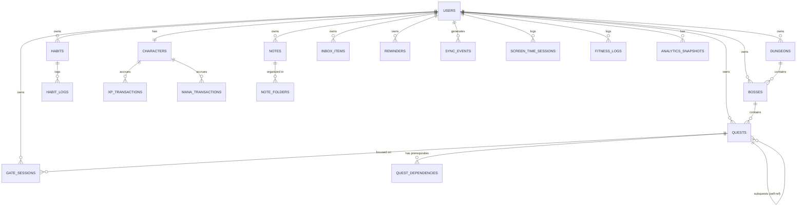
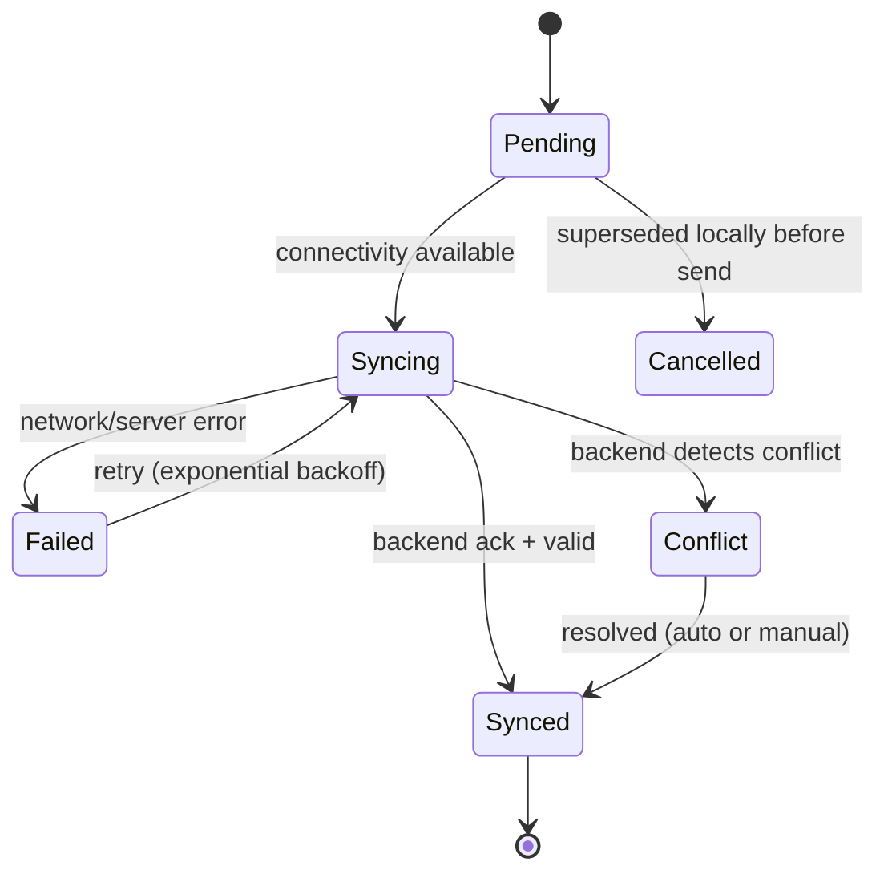

---

## 6. Data Model & Database Design

### 6.1 Entity-Relationship Diagram (core entities)



### 6.2 Key Table Schemas (PostgreSQL — authoritative)

```
users
  id UUID PK, email, password_hash, created_at, updated_at, difficulty_mode

characters
  id UUID PK, user_id FK -> users.id (unique), level, total_xp, mana, energy,
  coins, gems, active_title_id, rank, stats JSONB, updated_at

quests
  id UUID PK, user_id FK, boss_id FK NULL, parent_quest_id FK NULL (self-ref),
  title, description, quest_type ENUM(daily,main,side,recurring,boss,ai_generated),
  priority, difficulty, deadline TIMESTAMPTZ NULL, estimated_minutes, actual_minutes NULL,
  status ENUM(active,in_progress,completed,archived,trashed), eisenhower_quadrant NULL,
  recurrence_rule JSONB NULL, tags TEXT[], is_favorite BOOL, is_pinned BOOL,
  created_at, updated_at, completed_at NULL

quest_dependencies
  id UUID PK, quest_id FK, depends_on_quest_id FK

habits
  id UUID PK, user_id FK, title, frequency JSONB, skip_allowance INT,
  current_streak INT, longest_streak INT, reminder_times TIME[], created_at

habit_logs
  id UUID PK, habit_id FK, completed_at TIMESTAMPTZ, skipped BOOL

bosses
  id UUID PK, user_id FK, dungeon_id FK NULL, title, hp_max, hp_current,
  difficulty, deadline NULL, status ENUM(active,defeated), created_at

dungeons
  id UUID PK, user_id FK, title, status ENUM(active,completed), created_at

gate_sessions
  id UUID PK, user_id FK, quest_id FK NULL, started_at, ended_at NULL,
  planned_duration_s, actual_duration_s NULL, pause_count INT,
  exit_reason NULL, status ENUM(in_progress,completed,collapsed),
  stability_final NUMERIC NULL, xp_awarded NULL, mana_delta NULL, device_id, client_event_id UNIQUE

xp_transactions
  id UUID PK, character_id FK, amount, source_event_type, source_event_id,
  created_at

mana_transactions
  id UUID PK, character_id FK, delta, source_event_type, source_event_id, created_at

screen_time_sessions
  id UUID PK, user_id FK, app_package, category, duration_s, occurred_at, mana_modifier_applied

inbox_items
  id UUID PK, user_id FK, raw_content, capture_type ENUM(text,voice,photo,screenshot),
  status ENUM(unsorted,triaged,converted), ai_suggested_destination JSONB NULL,
  created_at

notes
  id UUID PK, user_id FK, folder_id FK NULL, title, body, tags TEXT[],
  notion_page_id NULL, sync_status, created_at, updated_at

reminders
  id UUID PK, user_id FK, type ENUM(quest,habit,deadline,wellness,behavioral),
  trigger_config JSONB, message, active BOOL

analytics_snapshots
  id UUID PK, user_id FK, period ENUM(daily,weekly,monthly,yearly), period_start,
  metrics JSONB, ai_summary TEXT NULL, created_at

sync_events   -- backend-side mirror of the client event queue; also the Event Sourcing log
  id UUID PK, user_id FK, device_id, event_type, payload JSONB, occurred_at_client,
  received_at_server, sync_status ENUM(pending,syncing,synced,failed,conflict,cancelled),
  retry_count INT, version INT
```

### 6.3 Local (Client) Database

The local database (SQLite via Drift, or Isar) mirrors the backend's user-scoped tables (`quests`, `habits`, `bosses`, `dungeons`, `notes`, `gate_sessions`, `reminders`, `inbox_items`, `screen_time_sessions`, `fitness_logs`, plus a cached, read-mostly copy of `characters` and `analytics_snapshots`) and additionally owns a `local_event_queue` table with the shape described in Section 7.2. Every locally-mutable table carries a `sync_status` column mirroring the states in Section 7.

---

## 7. Event Catalog & Synchronization Specification

### 7.1 Domain Event Catalog

| Event | Trigger | Key Payload Fields | Consumers |
|---|---|---|---|
| `QuestCreated` | User/AI creates a Quest | questId, title, type, parentId, bossId | Search, Analytics |
| `QuestEdited` | Any Quest field changes | questId, changedFields | Search, Analytics |
| `QuestCompleted` | User marks Quest done | questId, difficulty, durationActual, bossId, tags | XP, Boss, Analytics, Achievement, Habit(if linked) |
| `QuestDeleted` | User trashes/permanently deletes | questId, softDelete(bool) | Search, Analytics |
| `HabitCompleted` | User logs a Habit occurrence | habitId, streakBefore | XP, Mana, Analytics |
| `HabitSkipped` | User uses skip allowance | habitId | Analytics |
| `GateEntered` | User starts a Gate session | sessionId, questId, plannedDuration | Analytics |
| `GateCompleted` | Session finishes successfully | sessionId, actualDuration, stabilityFinal | XP, Mana, Analytics |
| `GateCollapsed` | Session exited early past threshold | sessionId, exitReason | XP(penalty), Mana(penalty), Boss(possible recovery), Analytics |
| `BossDamaged` | Related Quest completed | bossId, damage, hpRemaining | Analytics, Achievement |
| `BossDefeated` | Boss HP reaches 0 | bossId | Character(title/rank), Analytics, Achievement |
| `ReminderCompleted` | User acknowledges a reminder | reminderId | Analytics |
| `ScreenTimeRecorded` | App usage session logged | appPackage, durationS, category | Mana, Analytics |
| `NoteCreated` / `NoteEdited` | Note CRUD | noteId | Search, Integrations(Notion) |
| `InboxItemCaptured` | Quick Capture used | inboxItemId, captureType | AI Triage queue |
| `InboxItemTriaged` | AI suggestion approved | inboxItemId, destinationType, destinationId | Quest/Note/Boss module |

### 7.2 Local Event Queue Record

```
local_event_queue
  event_id UUID (client-generated, globally unique) PK
  user_id
  event_type
  payload JSONB
  device_id
  occurred_at_client TIMESTAMPTZ
  sync_status ENUM(pending,syncing,synced,failed,conflict,cancelled)
  retry_count INT DEFAULT 0
  version INT
```

Event states: **Pending** (queued, not yet sent) → **Syncing** (in-flight) → **Synced** (backend acknowered + authoritative result applied) | **Failed** (retry with backoff) | **Conflict** (needs resolution per Section 7.3) | **Cancelled** (superseded by a later local event, e.g., a create immediately followed by a delete before ever syncing).



Retry policy: exponential backoff starting at 2s, doubling to a max of 5 minutes, capped at a configurable max retry count before surfacing a manual "sync failed" indicator to the user; duplicate `event_id`s are rejected server-side as idempotency keys.

### 7.3 Conflict Resolution Strategy by Entity

| Entity | Strategy |
|---|---|
| Quest (title/description/tags) | Field-level merge where possible; last-write-wins per field otherwise |
| Quest completion / deletion | Server-authoritative: once completed/deleted on the server, offline edits from a stale client are rejected and the client reconciles |
| Notes | Manual conflict resolution UI (show both versions, let user merge) — content is user-authored prose, not safe to auto-merge |
| Character progression (XP, Mana, Level, Boss HP, streaks) | Server authority always wins; client value is only ever a "pending" prediction (Section 3.12, FR-VALID-1) |
| Gate sessions | Server-validated on sync (Section 4.28); rejected sessions revert to an "invalid" status with an explanatory client notice |
| Settings | Last-write-wins by timestamp |

### 7.4 Verified vs. Pending Data

Any client-displayed progression value (XP, Boss HP, achievement unlock) SHALL be tagged internally as **Pending** (locally predicted, optimistic) or **Verified** (confirmed by backend), so the UI can, if desired, subtly distinguish them (e.g., a slightly muted color for Pending) without blocking interaction.

---
