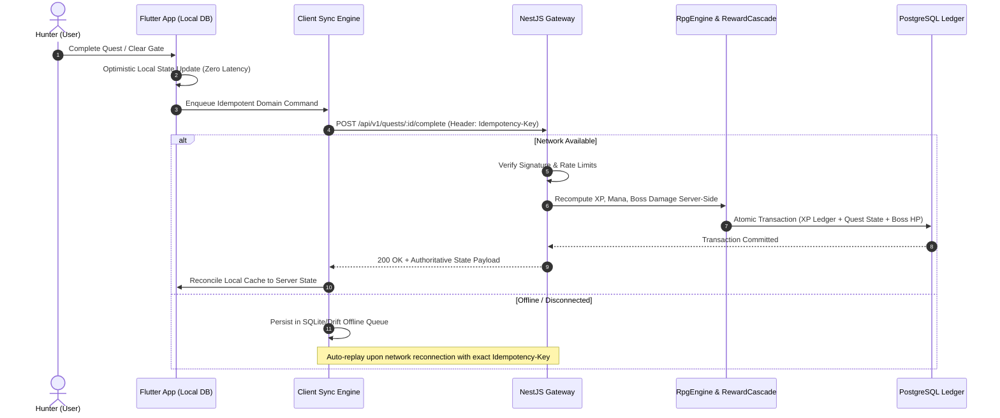

<div align="center">

# ⚔️ A R I S E
### *The Offline-First, AI-Assisted Gamified Life Operating System*

[](https://github.com/wantedfelconer/Arise)
[](https://github.com/wantedfelconer/Arise)
[](https://nestjs.com)
[](https://flutter.dev)
[](https://www.typescriptlang.org/)
[](https://www.postgresql.org/)
[](https://redis.io)
[](LICENSE)

<p align="center">
  <b>Reframe your daily life, habits, focus, and projects into a high-stakes RPG progression system.</b><br>
  Built on a hardened modular monolith, zero-latency local-first replication, and grounded multi-modal AI intelligence.
</p>

[Key Features](#-key-features) •
[Architecture](#-system-architecture) •
[Quickstart](#-quickstart-guide) •
[Game Engine](#-core-game-mechanics) •
[Security & Anti-Cheat](#-security--anti-cheat-controls) •
[API Reference](#-api-specification) •
[Documentation](#-documentation--adr)

---

</div>

## 🌌 Overview

**ARISE** transforms human personal productivity, cognitive energy management, and life planning into an immersive, Hunter-rank progression experience (inspired by *Solo Leveling* and high-performance game loops). 

Unlike conventional to-do apps that fail due to motivational decay, ARISE combines **mathematical RPG reward loops**, **biometric/screen-time telemetry**, **real-time focus dungeons (Gates)**, and an **offline-first command-event sync architecture** backed by an authoritative server ledger.

### 🌟 Why ARISE?

* **🎮 True RPG Progression:** Dynamic rank evolution from **Rank E to National Level**, multi-stat attribute radars (Intelligence, Discipline, Fitness, Creativity, Coding, Business, Health), and double-entry ledger audits for XP and Mana.
* **⚡ Offline-First with Zero-Latency UI:** Full client autonomy using local database persistence (Drift / Isar). Writes succeed instantly; asynchronous domain commands sync in the background with strict idempotency.
* **🛡️ Absolute Server Authority & Anti-Cheat:** The client is never trusted for final numerical values. XP, Levels, Mana reserves, Boss damage, and Streaks are computed authoritatively on the backend.
* **🧠 Cognitive & Bio-Rhythm Engines:** Circadian energy modeling dynamically schedules tasks around your peak alertness windows while screen-time monitoring drains Mana upon app doomscrolling.
* **🤖 Grounded AI Oracle & Two-Stage Planner:** Generative AI that proposes, but never commits without user consent. AI Coach grounded in your real-world performance telemetry.
* **🏛️ Enterprise Clean Architecture:** Built as an enterprise-grade NestJS Modular Monolith on the backend and Clean Architecture (Presentation $\leftrightarrow$ Application $\leftrightarrow$ Domain $\leftarrow$ Infrastructure) on Flutter.

---

## 🏛️ System Architecture

ARISE enforces a strict separation between client-side optimistic execution and server-authoritative reconciliation:

```
+-----------------------------------------------------------------------------------+
|                                  FLUTTER CLIENTS                                  |
|            Presentation  <--->  Application (Use Cases)  <--->  Domain             |
|                                         |                                         |
|                 Local Database (Drift / Isar) + Sync Engine Queue                 |
+------------------------------------------+----------------------------------------+
                                           | HTTPS / JSON (Idempotent Domain Commands)
                                           v
+-----------------------------------------------------------------------------------+
|                             NESTJS MODULAR MONOLITH                               |
|                                                                                   |
|  [Global Middleware, Guards & Pipes]                                              |
|    • GlobalExceptionFilter (RFC 7807 Problem Details)                             |
|    • RateLimitGuard (Proxy-aware sliding window rate limiter)                     |
|    • JwtAuthGuard (RS256 Bearer Token Verification & Session Family Invalidation) |
|    • ZodValidationPipe (Strict DTO schema validation & input sanitization)        |
|                                                                                   |
|  [16 Domain Feature Modules]                                                      |
|    • auth             • character        • quests           • bosses              |
|    • dungeons         • gates            • achievements     • screen-time         |
|    • fitness          • mood             • notes            • reminders           |
|    • notifications    • music            • settings         • statistics          |
|    • analytics        • ai (planner / coach / quota)                              |
|                                                                                   |
|  [Centralized Core Engines]                                                       |
|    • RpgEngine (XP Curves, Circadian Models, Boss Damage, Gate Stability)         |
|    • RewardCascadeService (Atomic single-transaction quest/boss/gate payouts)     |
|                                                                                   |
|  [Persistence & Messaging Layer]                                                  |
|    • Prisma ORM (26 normalized relational models with compound indexes)           |
|    • PostgreSQL 16 (Authoritative relational storage)                             |
|    • Redis 7 & BullMQ (Distributed cache & background job orchestrator)           |
+-----------------------------------------------------------------------------------+
```

### Data Flow & Offline Sync Protocol



---

## 🚀 Key Features

### 1. ⚔️ Quest & Campaign System
* **Recursive Subquests & Dependencies:** Create deep task hierarchies; child quest completion contributes dynamically to parent milestone progress.
* **Smart Recurrence & NLP Quick Capture:** Natural-language task entry with automated tag, difficulty, and due-date extraction.
* **Difficulty Multipliers:** Tasks scaled by cognitive load (Trivial, Easy, Medium, Hard, Epic) with dynamic XP/Gold reward yields.

### 2. 👹 Boss Raids & Dungeon Campaigns
* **Projects as Raid Bosses:** Long-term goals represented as Boss entities with distinct HP bars. Completing linked quests deals direct physical/magical damage.
* **Multi-Stage Dungeons:** Progress through sequential task stages to unlock dungeon clear rewards, rare achievements, and massive stat surges.

### 3. 🌀 Gate Focus Protocol (Gamified Pomodoro)
* **Real-Time Stability Gauge:** Deep work sessions framed as dimensional Gates. Maintaining uninterrupted focus keeps Gate Stability above 95%.
* **Collapse Penalties:** Abandoning or interrupting active focus sessions induces Gate Collapse, triggering Mana penalties and streak breaks.

### 4. 📱 Screen Time Intelligence & Distraction Defense
* **Automated Usage Ingestion:** Ingests application runtime telemetry directly from mobile clients.
* **Mana Siphon Engine:** Excessive social media or entertainment consumption actively drains character Mana, requiring productive recovery habits to replenish.

### 5. 🤖 Grounded AI Oracle & Coach
* **Two-Stage Task Deconstruction:** AI generates structured breakdown plans for complex projects. Requires explicit Hunter approval before mutating domain data.
* **Context-Grounded Coaching:** Real-time conversational coach grounded in your habit streaks, overdue quests, and circadian energy levels.
* **Strict Quota Isolation:** Thread-safe daily quota allocation with per-user distributed mutexes to prevent token starvation.

---

## 🧮 Core Game Mechanics

ARISE models human productivity through deterministic, config-driven mathematical engines:

### Character Leveling Curve
Character levels are computed strictly on the backend ledger from verified lifetime XP:

$$\text{Level} = \left\lfloor 0.1 \times \sqrt{\text{Total XP}} \right\rfloor + 1$$

| Hunter Rank | Minimum Level | Maximum Level | Reward Multiplier |
|:---:|:---:|:---:|:---:|
| **E-Rank** | Level 1 | Level 10 | $1.0\times$ |
| **D-Rank** | Level 11 | Level 25 | $1.15\times$ |
| **C-Rank** | Level 26 | Level 45 | $1.30\times$ |
| **B-Rank** | Level 46 | Level 70 | $1.50\times$ |
| **A-Rank** | Level 71 | Level 99 | $1.75\times$ |
| **S-Rank** | Level 100 | Level 149 | $2.00\times$ |
| **National Level** | Level 150+ | $\infty$ | $2.50\times$ |

### Circadian Energy Distribution
Dynamic energy availability ($E_t \in [0, 100]$) is calculated on an hourly curve based on the user's defined chronotype:
* **Morning Lark:** Peak cognitive bandwidth between 08:00 – 12:00.
* **Night Owl:** Peak cognitive bandwidth between 19:00 – 23:00.
* **Intermediate / Third Bird:** Balanced dual-peak curve at 10:00 and 16:00.

---

## 🛡️ Security & Anti-Cheat Controls

ARISE implements defense-in-depth across the entire request lifecycle. The system is verified against **16 comprehensive attack vectors**:

| Attack Vector | Vulnerability Description | Defense Architecture |
|:---|:---|:---|
| **XP / Stat Forgery** | Client attempts submitting `{ xp: 9999999 }` | Request payload stripped by strict Zod schema; XP computed purely server-side from ledger. |
| **Level Manipulation** | Client attempts submitting `{ level: 999 }` | Level is calculated dynamically from authoritative `xp_transactions` rows. |
| **Mana Ingestion Spoofing** | Client sends fake Mana values during telemetry upload | Mana deltas are recalculated via backend `screen_time_modifiers.json` rules. |
| **Boss Instant Kill** | Direct modification of Boss current HP | No direct HP mutation endpoint exists; HP only decreases through verified quest completions. |
| **Duplicate Completion Replay** | Rapid replay of completed quest payloads | Strict `Idempotency-Key` tracking and atomic database locks ensure rewards are awarded exactly once. |
| **Gate Duration Spoofing** | Client claims 60 min focus completed in 5 sec | Elapsed time verified against server timestamp delta ($t_{\text{now}} - t_{\text{start}}$). |
| **Feature Flag Tampering** | Client attempts setting `{ isPremium: true }` | Feature flags are read-only client side and managed exclusively by server policy. |
| **AI Quota Race Conditions** | Concurrent async calls to exhaust AI quota | Synchronized per-user distributed mutex lock prevents race-condition bypasses. |
| **Token Family Hijacking** | Refresh token reuse after theft | Automatic reuse detection immediately invalidates all active sessions across the user's token family. |
| **Cross-Tenant Data Access** | User A requesting User B's resources | Enforced tenant scoping on every repository query; returns RFC 7807 404/403. |

---

## 💻 Tech Stack

<table>
  <tr>
    <th width="20%">Layer</th>
    <th width="40%">Technology</th>
    <th width="40%">Purpose</th>
  </tr>
  <tr>
    <td><b>Backend Framework</b></td>
    <td><code>NestJS 10.4</code> (Node.js 20+ / TypeScript 5.7)</td>
    <td>Modular Monolith architecture, Dependency Injection, Guards, Filters, Interceptors.</td>
  </tr>
  <tr>
    <td><b>Mobile & Frontend</b></td>
    <td><code>Flutter 3.x</code> / <code>Dart 3.x</code></td>
    <td>Cross-platform native mobile & desktop application with custom Cyber-Dark theme.</td>
  </tr>
  <tr>
    <td><b>State & Local DB</b></td>
    <td><code>Riverpod 2.5</code> • <code>Drift / Isar</code></td>
    <td>Reactive state management and local-first SQLite persistence layer.</td>
  </tr>
  <tr>
    <td><b>Database & ORM</b></td>
    <td><code>PostgreSQL 16</code> • <code>Prisma ORM 5.22</code></td>
    <td>26 normalized relational models, double-entry ledger transactions, composite indexing.</td>
  </tr>
  <tr>
    <td><b>Cache & Queues</b></td>
    <td><code>Redis 7</code> • <code>BullMQ 5.34</code></td>
    <td>Distributed rate limiting, session cache, and asynchronous background worker queues.</td>
  </tr>
  <tr>
    <td><b>Security & Auth</b></td>
    <td><code>Argon2id</code> • <code>RS256 JWT</code> • <code>Zod</code></td>
    <td>Cryptographic password hashing, rotating token pairs, and strict schema sanitization.</td>
  </tr>
  <tr>
    <td><b>AI Integration</b></td>
    <td><code>Google Gemini</code> • <code>OpenAI</code> • <code>Claude</code></td>
    <td>Pluggable AI provider abstraction for smart planning, coach chats, and natural NLP.</td>
  </tr>
  <tr>
    <td><b>Testing & Quality</b></td>
    <td><code>Vitest 2.1</code> • <code>Supertest</code> • <code>Flutter Test</code></td>
    <td>Unit, integration, idempotency replay, and full-suite security audit tests.</td>
  </tr>
</table>

---

## 📂 Repository Structure

```
arise/
├── .agents/                 # AI coding agent rules, skills, and execution playbooks
│   ├── rules/               # Architectural constitution and Flutter rules
│   └── skills/              # Specialized domain engineering skills
├── backend/                 # NestJS Modular Monolith Server
│   ├── src/
│   │   ├── config/          # Balance tables (XP curves, ranks, modifiers, damage)
│   │   ├── core/            # Centralized engines (RpgEngine, RewardCascade, Errors)
│   │   ├── db/              # Prisma schema, migrations, and MemoryDb fallback
│   │   ├── jobs/            # BullMQ background workers and cron tasks
│   │   └── modules/         # 16 isolated feature modules (Clean Architecture)
│   │       ├── auth/        # Authentication, RS256 JWT, refresh rotation
│   │       ├── character/   # Character stats, ledger, and ranks
│   │       ├── quests/      # Quests, subtasks, recurrence, NLP parsing
│   │       ├── bosses/      # Boss entities, raid mechanics, damage attribution
│   │       ├── dungeons/    # Multi-stage dungeon campaigns
│   │       ├── gates/       # Focus timers, stability tracking, collapse handling
│   │       ├── ai/          # AI Coach, Planner, and Quota management
│   │       ├── screen-time/ # App telemetry ingestion and Mana burn rules
│   │       └── ...          # notes, fitness, mood, reminders, statistics, settings
│   └── tests/               # Security, integration, and idempotency test suites
├── flutter frontend/        # Native Flutter Application
│   ├── lib/
│   │   ├── app/             # Application lifecycle, routing, and theme configuration
│   │   ├── core/            # Core utilities, API clients, and network interceptors
│   │   ├── features/        # Feature presentation, state notifiers, and UI widgets
│   │   └── shared/          # Reusable cyber-dark UI components and design system
│   └── pubspec.yaml         # Flutter dependencies and assets configuration
├── docs/                    # Authoritative engineering documentation
│   ├── ARISE_SRS.md         # Comprehensive Software Requirements Specification
│   ├── SPRINT_PLAN.md       # Multi-sprint execution plan and milestone tracker
│   └── adr/                 # Architecture Decision Records (ADRs)
└── docker-compose.yml       # Infrastructure orchestration (PostgreSQL 16 + Redis 7)
```

---

## 🚦 Quickstart Guide

### Prerequisites
* **Node.js:** `v20.x` or higher
* **npm:** `v10.x` or higher (or `pnpm`)
* **Flutter SDK:** `v3.19.x` or higher
* **Docker & Docker Compose:** Latest stable release

---

### 1. Clone & Setup Environment

```bash
# Clone the repository
git clone https://github.com/wantedfelconer/Arise.git
cd Arise

# Copy environment template
cp .env.example backend/.env
```

### 2. Start Infrastructure Containers

Launch the authoritative PostgreSQL 16 database and Redis 7 cache with Docker Compose:

```bash
docker compose up -d
```

Verify services are healthy:
```bash
docker compose ps
```

---

### 3. Initialize & Run Backend

```bash
cd backend

# Install dependencies
npm install

# Generate Prisma Client & Run Database Migrations
npm run prisma:generate
npm run prisma:migrate

# Launch backend in development watch mode
npm run start:dev
```

The API will boot at `http://localhost:3000`. Health check endpoint: `GET http://localhost:3000/health`.

---

### 4. Launch Flutter Application

In a separate terminal window:

```bash
cd "flutter frontend"

# Install Flutter dependencies
flutter pub get

# Launch on connected device, simulator, or desktop
flutter run
```

---

## 🧪 Testing & Verification

ARISE features an automated test harness covering unit logic, integration endpoints, offline replay, and security penetration scenarios:

```bash
cd backend

# Run full test suite with Vitest
npm test

# Run tests with code coverage analysis
npm run test:coverage

# Execute specific security audit test suite
npx vitest run tests/sprint5-security-audit.test.ts

# Execute offline idempotency replay audit
npx vitest run tests/sprint5-offline-idempotency-audit.test.ts
```

---

## 📖 API Specification

All API endpoints follow RESTful design principles and return errors matching the **RFC 7807 Problem Details** standard.

### Core Endpoints

| Method | Path | Description | Auth Required |
|:---:|:---|:---|:---:|
| `POST` | `/api/v1/auth/signup` | Register new Hunter account | ❌ |
| `POST` | `/api/v1/auth/login` | Authenticate and issue RS256 token pair | ❌ |
| `POST` | `/api/v1/auth/refresh` | Rotate access token via refresh token | ❌ |
| `GET` | `/api/v1/character` | Fetch character profile, level, and stats | 🔒 Bearer |
| `GET` | `/api/v1/character/ledger` | Query immutable XP & Mana transaction history | 🔒 Bearer |
| `GET` | `/api/v1/quests` | List active, paused, and completed quests | 🔒 Bearer |
| `POST` | `/api/v1/quests` | Create quest (supports subquests & recurrence) | 🔒 Bearer |
| `POST` | `/api/v1/quests/:id/complete` | Complete quest and trigger reward cascade | 🔒 Bearer |
| `GET` | `/api/v1/bosses` | Fetch active Boss raids and progress | 🔒 Bearer |
| `POST` | `/api/v1/gates/sessions` | Initiate Gate focus expedition | 🔒 Bearer |
| `POST` | `/api/v1/gates/sessions/:id/complete` | Complete Gate focus session with stability score | 🔒 Bearer |
| `POST` | `/api/v1/gates/sessions/:id/collapse` | Report focus collapse & apply penalties | 🔒 Bearer |
| `POST` | `/api/v1/screen-time/sessions` | Ingest app usage telemetry for Mana calc | 🔒 Bearer |
| `POST` | `/api/v1/ai/plan` | Propose AI task deconstruction plan | 🔒 Bearer |
| `POST` | `/api/v1/ai/plan/:id/approve` | Commit approved AI plan to domain data | 🔒 Bearer |
| `POST` | `/api/v1/ai/coach/chat` | Context-aware AI coach conversation | 🔒 Bearer |

### Sample Request: Complete Quest (Idempotent)

```bash
curl -X POST http://localhost:3000/api/v1/quests/quest_01j9a4b2c8/complete \
  -H "Authorization: Bearer <JWT_ACCESS_TOKEN>" \
  -H "Idempotency-Key: 8f3d1b82-62a5-4f51-a5cf-81b0f59a3e21" \
  -H "Content-Type: application/json"
```

---

## 🗺️ Product Roadmap

- [x] **Sprint 1:** Foundation, Auth (Argon2id/RS256), Character Ledger, Centralized RPG Engine.
- [x] **Sprint 2:** Quests & Subquests, Recurring Schedules, Boss Raids, Dungeon Instances.
- [x] **Sprint 3:** Gate Focus System, Screen Time Mana Siphon, Habits, Notifications.
- [x] **Sprint 4:** Grounded AI Coach & Planner, Notes, Fitness, Mood, Reminders, Analytics.
- [x] **Sprint 5:** Enterprise Hardening, Security Matrix Verification, Offline Replay Audit.
- [ ] **Phase 2 (Post-MVP):**
  - [ ] Hunter Guilds & Co-Op Boss Raids.
  - [ ] Global & Guild Seasonal Leaderboards.
  - [ ] Obsidian-Style Visual Knowledge Graph for Notes.
  - [ ] Wearable Biometric Integration (Apple Health / Health Connect Live Sync).
  - [ ] Multi-platform desktop status bar widgets.

---

## 📚 Documentation & ADR

Comprehensive system specifications, architectural decisions, and verification records are maintained in the [`docs/`](docs/) directory:

* 📄 **[ARISE System Requirements Specification (SRS)](docs/ARISE_SRS.md):** Complete functional, non-functional, and data model specification.
* 📋 **[Multi-Sprint Engineering Plan](docs/SPRINT_PLAN.md):** 5-sprint roadmap and historical completion milestones.
* 🏛️ **[Architecture Decision Records (ADRs)](docs/adr/):**
  * `0001` - [Scope & SRS Document Reconciliation](docs/adr/0001-scope-and-doc-reconciliation.md)
  * `0002` - [Backend Framework Migration: Express to NestJS Modular Monolith](docs/adr/0002-backend-framework-migration-express-to-nestjs.md)
* 🛡️ **[Final Verification & Hardening Handoff](HANDOFF_FINAL.md):** Production readiness, performance audit, and 16-vector security verification evidence.

---

## 🤝 Contributing

We welcome contributions from the community to help make ARISE the ultimate Life Operating System.

1. **Fork the Repository**
2. **Create a Feature Branch:** `git checkout -b feature/amazing-feature`
3. **Commit your Changes:** `git commit -m "feat(quests): add dynamic difficulty weighting"`
4. **Push to Branch:** `git push origin feature/amazing-feature`
5. **Open a Pull Request**

Please ensure all tests pass (`npm test`) and code adheres to Clean Architecture rules before submitting PRs.

---

## 📄 License

This project is licensed under the **MIT License** — see the [LICENSE](LICENSE) file for details.

<div align="center">
  <sub>Engineered with precision for hunters leveling up in real life.</sub>
</div>
