# ARISE — Life Operating System

## Software Requirements Specification (SRS)

**Version:** 1.0
**Status:** Draft for Engineering Handoff (AI Coding Agent + Human Review)
**Prepared for:** Backend implementation and Frontend (Flutter) integration
**Target build agent:** Antigravity (Gemini 3.1) coding agent, operating against an existing Flutter frontend

---

## Document Purpose Note (read first)

This SRS consolidates four source inputs into a single authoritative specification:

1. **Core Product Vision** — the RPG/Life-OS concept, modules, and preferred stack.
2. **Extra Features Backlog** — a brainstorm of features (Habits, Inbox/Quick Capture, Smart Recurrence, NLP input, Dependencies, Kanban, etc.) evaluated and triaged into MVP vs. Later Phases.
3. **Offline-First / Local-First Architecture Addendum** — mandates a local-first client with an authoritative backend and event-based synchronization.
4. **Project Architecture Constitution** — mandates a Modular Monolith, Clean Architecture, Feature-First organization, centralized game engines, and AI/integration provider abstraction, written to keep the system human-maintainable after AI-assisted development.

All four inputs are treated as binding constraints, not suggestions. Where the Extra Features Backlog proposed postponing a feature (social, cosmetics, seasonal events, leaderboards, etc.), that triage is honored in this SRS's MVP scope and reflected in the Future Roadmap (Section 15). Where the backlog flagged a feature as critical (Habits, Inbox + AI Triage, Smart Recurrence, Natural Language Input, Dependencies, Undo, Search, Kanban/Multiple Views), it has been promoted into the MVP functional requirements in Section 4, because omitting them would — as the source material itself argues — reduce the product to "just another task manager," which contradicts the Life-OS vision.

This document is written so that an AI coding agent can use it as a build contract: concrete module boundaries, folder structures, data schemas, event contracts, and API surfaces are specified explicitly enough to scaffold a backend and wire it to an already-existing frontend without further clarification on architecture-level decisions. Product/UX judgment calls are still expected of the implementer within the stated constraints.

---

## Table of Contents

1. Introduction
2. Overall Description
3. System Architecture
4. Functional Requirements
5. Non-Functional Requirements
6. Data Model & Database Design
7. Event Catalog & Synchronization Specification
8. API Specification
9. Screen Specifications & Navigation Flow
10. Behavioral Diagrams (Sequence / Activity / State)
11. AI Architecture
12. Use Cases
13. User Stories
14. Acceptance Criteria
15. Future Roadmap
16. Appendices

---

## 1. Introduction

### 1.1 Purpose

This document specifies the functional and non-functional requirements, system architecture, data model, API contract, and behavioral design for **ARISE**, an AI-powered, gamified, offline-first personal productivity platform that reframes a user's real-world responsibilities as an RPG progression system. It is intended to drive backend implementation and its integration with an existing Flutter frontend, and to serve as the shared reference between product, design, and engineering (human or AI) for the lifetime of the project.

### 1.2 Document Conventions

- Requirement IDs: `FR-<module>-<n>` (functional), `NFR-<category>-<n>` (non-functional), `UC-<n>` (use case), `US-<n>` (user story), `AC-<n>` (acceptance criteria).
- Keywords **MUST / SHALL**, **SHOULD**, **MAY** follow RFC 2119 semantics: MUST/SHALL = mandatory, SHOULD = strongly recommended (deviation requires justification), MAY = optional.
- Diagrams are provided as Mermaid code blocks so they are both human-readable and machine-parseable by a coding agent.
- Database columns are described in lightweight SQL-ish tables; the authoritative schema lives in the backend module's `migrations/`.

### 1.3 Intended Audience

- The AI coding agent (Antigravity / Gemini 3.1) responsible for scaffolding the backend, the local database layer, the sync engine, and the API contract consumed by the existing Flutter frontend.
- Human engineering owner(s) who will review, refactor, and maintain the codebase after MVP completion.
- Product/design stakeholders validating scope.

### 1.4 Product Scope

**In scope for MVP (v1):**

Authentication; Character & RPG stat system; XP/Mana/Energy engines; Quest system (with nesting, dependencies, smart recurrence); Habit system; Inbox & Quick Capture with AI Triage; Natural Language quest input; AI Quest Planner; Boss system; Dungeon system; Gate Focus system; Screen Time Intelligence; Reminder Engine (including behavioral reminders); AI Coach (daily planning, weekly review, procrastination/overload detection, rescheduling suggestions); Notes (with Notion sync); Analytics & Reports; Fitness tracking; Calendar; Music & Brain Reset; Notifications; Settings; Integrations (Notion, Google Calendar, Health Connect/Apple Health); Search-everywhere; Undo/Trash/Archive; Multiple views (List/Kanban/Calendar/Timeline/Agenda); Difficulty Modes (Casual/Hardcore); full Offline-First operation with event-based sync and backend-authoritative validation.

**Explicitly out of scope for MVP** (deferred — see Section 15 Future Roadmap): Prestige system; cosmetic collections/shop; seasonal events; daily/weekly meta-challenges; mystery reward chests; leaderboards; guilds/friends/social feed/public profiles/PvP; full Knowledge-Vault graph (Obsidian-style backlinking); collaborative/shared Bosses and study groups; "Future Self" time-capsule messages; voice notes; Spotify integration; multi-language localization; desktop widgets.

This scope split is a direct application of the Extra Features Backlog's own "keep MVP focused" triage, with the single exception that Habits, Inbox/AI Triage, Smart Recurrence, NLP input, Dependencies, Search, Undo, Kanban, and Multiple Views are pulled **into** MVP, since the backlog identifies these as foundational to the Life-OS premise rather than as nice-to-haves.

### 1.5 Definitions, Acronyms, Abbreviations

| Term | Definition |
|---|---|
| Quest | A single unit of work (task), the atomic productivity object. Supports unlimited nesting into Subquests. |
| Boss | A project — a container of related Quests with HP that depletes as Quests complete. |
| Dungeon | A collection of related Bosses (e.g., a semester, a company launch). |
| Gate / Gate Expedition | A focus session (replaces Pomodoro timer), framed as entering a "Gate" that stabilizes as focus is sustained. |
| Character | The user's single RPG persona: Level, XP, Mana, Energy, Coins, Gems, Titles, Ranks, Stats. |
| XP | Experience Points; drives Character Level. |
| Mana | Mental-resource resource; depletes with distraction/screen time, replenishes with completed work, exercise, sleep. |
| Energy | Biological-readiness resource, following the user's circadian rhythm. |
| Habit | A repeating behavior tracked indefinitely (not "completed," but performed on a cadence), distinct from a Quest. |
| Inbox | An unsorted capture zone for raw thoughts/tasks/ideas awaiting AI Triage. |
| AI Triage | The AI process that reviews Inbox items and proposes their destination (Quest, Note, Boss subtask, scheduled item). |
| Sync Engine | The client-side subsystem that queues local events and reconciles them with the backend. |
| Event Sourcing | Backend pattern of persisting immutable domain events as the system of record, in addition to current-state tables. |
| Modular Monolith | A single deployable backend composed of independently-owned, loosely-coupled feature modules. |
| Provider Abstraction | An interface layer decoupling business logic from a specific AI vendor or external integration SDK. |

### 1.6 References

- Source Document A — Core Product Vision ("PROJECT CONTEXT FOR CLAUDE").
- Source Document B — Extra Features Backlog ("Extra features that will be implemented later").
- Source Document C — Offline-First Architecture Addendum.
- Source Document D — Project Architecture Constitution.
- IEEE 830-1998 (SRS structure convention, adapted).
- RFC 2119 (requirement-level keywords).

---

## 2. Overall Description

### 2.1 Product Perspective

ARISE is a new, greenfield product. Its **frontend already exists** (Flutter, Riverpod) and this SRS governs the construction of the **backend, local database layer, sync engine, and API contract** the frontend will consume, plus any frontend-facing contract clarifications the AI coding agent needs to wire the two together (request/response DTOs, event payloads, auth flow). The backend is a self-hosted service (Node.js/Express/TypeScript/PostgreSQL) rather than a wrapper around a third-party BaaS, because the product's core mechanic — a backend-authoritative RPG progression system resistant to client tampering — requires custom validation logic that a generic BaaS does not provide out of the box.

### 2.2 Product Vision & Philosophy

ARISE is not a to-do list with a skin. It is a **Life Operating System**: an AI-assisted RPG layer over the user's real responsibilities, where the AI reduces planning overhead and the RPG framing sustains motivation over the long term that plain checklists fail to sustain. The interface aesthetic is **calm, minimal, premium, futuristic** — closer to Linear, Notion, Apple, and Obsidian than to a cartoon mobile game. Every feature must serve the following core loop; a feature that does not strengthen it does not belong in the product.

### 2.3 Core Product Loop

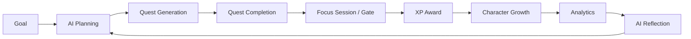

### 2.4 User Personas

| Persona | Segment | Core Need | Key Modules Used |
|---|---|---|---|
| **Amara**, university student | Primary | Turn a scary syllabus into a day-by-day plan; stay motivated through a long semester | AI Quest Planner, Dungeon (semester), Gate, Habit |
| **Rafi**, software engineer | Primary | Manage deep-work blocks, fight distraction, ship side-projects | Screen Time Intelligence, Gate, Boss (project), Mana |
| **Dr. Lin**, researcher | Primary | Break down a thesis/paper into dependent subtasks over months | Quest nesting + Dependencies, Boss, AI Coach weekly review |
| **Sam**, entrepreneur | Primary | Juggle many concurrent workstreams without losing sight of priorities | Kanban view, Dungeon, Analytics, AI Overload Detection |
| **Noor**, self-improvement / fitness enthusiast | Secondary | Build sustainable daily habits and see long-term consistency | Habit, Fitness, Mood/Energy correlation, Streaks |
| **Casual user** | Secondary | Light-touch task capture without RPG complexity getting in the way | Inbox/Quick Capture, Casual Difficulty Mode |

### 2.5 Operating Environment

- **Client:** Flutter (iOS, Android; desktop/web not required for MVP), Riverpod state management, local database (SQLite via Drift, or Isar).
- **Backend:** Node.js + Express.js + TypeScript, deployed as a modular-monolith HTTP service.
- **Database:** PostgreSQL (system of record); Redis (cache, queues, rate limiting).
- **Object storage:** S3-compatible storage for attachments (note images, PDFs, avatars).
- **AI:** Provider-abstracted (OpenAI / Gemini / Claude interchangeable behind one interface).
- **Push:** Firebase Cloud Messaging.

### 2.6 Design Constraints (binding, from the Architecture Constitution and Offline-First Addendum)

- **C-1**: Backend MUST be a Modular Monolith, not microservices, for MVP.
- **C-2**: Both frontend and backend MUST be organized Feature-First (by module), not by technical layer.
- **C-3**: Each module MUST own its presentation/application/domain/infrastructure (frontend) or controller/service/repository/validation/dto (backend) layers; no module reaches into another module's internals — cross-module communication happens only through public module interfaces or domain events.
- **C-4**: All RPG calculations (XP, Mana, Energy, Boss damage, streaks, achievements) MUST be computed by centralized Game Engines, never duplicated inline in feature code.
- **C-5**: The application MUST be Offline-First / Local-First: the local database is the runtime source of truth for UI purposes; the backend is the authoritative source of truth for progression data.
- **C-6**: Synchronization MUST be event-based (domain events queued and replayed), not whole-object overwrites.
- **C-7**: The client MUST be treated as untrusted. The backend MUST recompute and validate all progression-affecting values; the client only proposes actions.
- **C-8**: AI provider access and each external integration (Notion, Calendar, Health) MUST sit behind a provider-abstraction interface; business logic never calls a vendor SDK directly.
- **C-9**: Game-balance values (XP tables, level curves, reward tables, difficulty multipliers) MUST be externalized as configuration, not hardcoded in business logic.
- **C-10**: AI-generated quest plans MUST require explicit user approval before becoming active; the AI never silently commits state changes.

### 2.7 Assumptions & Dependencies

- The Flutter frontend already exists and is expected to be restructured (if not already) to a `features/<feature>/{presentation,application,domain,infrastructure}` layout to match this SRS; the AI coding agent should inspect the existing frontend and align the API contract to it, flagging any structural mismatches rather than silently working around them.
- AI provider API keys and Notion/Google OAuth credentials are supplied via environment configuration; no vendor keys are hardcoded.
- The MVP targets a single-user-per-account model; collaboration is out of scope (Section 15).

---

## 3. System Architecture

### 3.1 Architectural Style

ARISE combines: **Modular Monolith** (deployment/ownership boundary) + **Clean Architecture** (dependency direction within each module) + **Feature-First organization** (physical folder structure) + **Lightweight Domain-Driven Design** (framework-independent domain models) + **Repository Pattern** (storage abstraction) + **Event-Driven communication between modules** + **Offline-First / Local-First client architecture**. This combination is chosen specifically because the team is a solo/small developer transitioning off AI-assisted "vibe coding" into manual maintenance — it minimizes operational complexity (one deployable) while maximizing the odds that any single feature can be understood, replaced, or rewritten in isolation.

### 3.2 Offline-First / Local-First Model

The local database is the **primary runtime data source**; the backend is the **authoritative source of truth**, not the primary runtime database. The frontend never blocks its UI on a network round-trip for normal interactions. Internet connectivity is required only for: AI features, initial authentication, cloud synchronization, external integrations, remote backups, and push notifications. Every other interaction — creating, completing, editing, deleting, nesting, and organizing Quests, Habits, Notes, Gate sessions, and Reminders — MUST function fully offline.

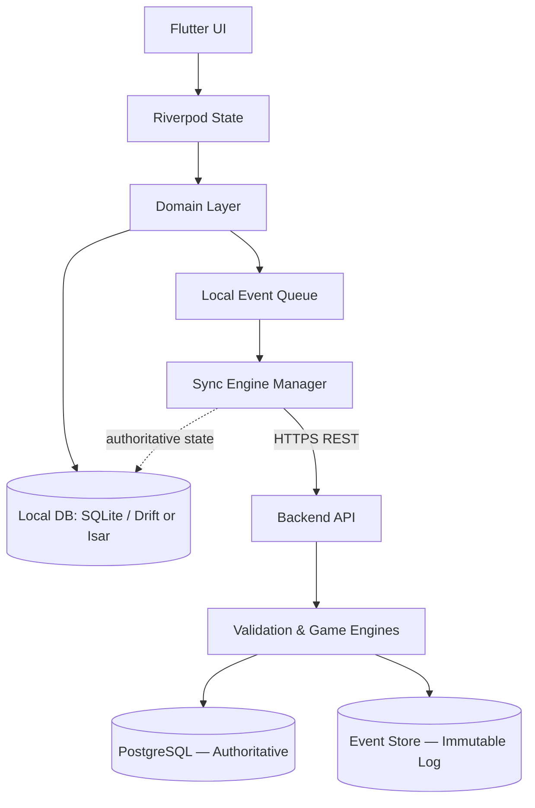

### 3.3 High-Level Component Diagram

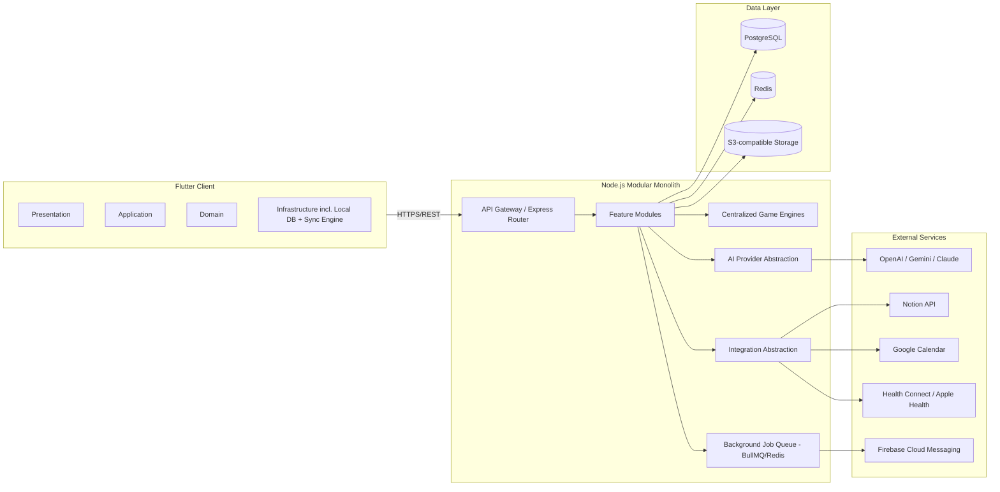

### 3.4 Frontend Architecture (per feature)

```
frontend/lib/features/<feature>/
  presentation/     -- widgets, screens, view-models (Riverpod providers/notifiers)
  application/       -- use-case orchestration, DTO <-> domain mapping
  domain/             -- pure Dart entities & value objects, no Flutter/HTTP/DB imports
  infrastructure/     -- local DB access (Drift/Isar), remote API client, repository impl
```

Dependency direction is inward only: `presentation -> application -> domain`; `infrastructure` implements interfaces defined in `domain`, so `domain` never imports `infrastructure`.

### 3.5 Backend Architecture (per module)

```
backend/src/modules/<module>/
  controller/    -- HTTP request handling only
  service/       -- business logic / orchestration
  repository/    -- PostgreSQL access via query builder/ORM
  validation/    -- request schema validation (e.g., zod)
  dto/           -- request/response shape definitions
  routes/        -- Express router for this module
  events/        -- domain events this module emits/consumes
  types/         -- module-local TypeScript types
  tests/         -- unit + integration tests
  README.md      -- purpose, public API, dependencies, DB tables, events, extension points
```

No module SHALL import another module's `repository` or internal `service` methods directly. Cross-module reads go through the other module's public `service` API; cross-module reactions go through domain events (Section 3.8).

### 3.6 Module Inventory

| Module | Frontend feature | Backend module | Owns |
|---|---|---|---|
| Auth | `features/auth` | `modules/auth` | Signup/login, JWT issuance, session refresh |
| Character | `features/character` | `modules/character` | Level, stats, titles, ranks, coins, gems |
| XP Engine | (shared) | `modules/xp` | XP calculation, level curve |
| Mana Engine | (shared) | `modules/mana` | Mana calculation, depletion/recovery rules |
| Energy Engine | (shared) | `modules/energy` | Circadian energy curve |
| Quest | `features/quests` | `modules/quests` | Quests, subquests, dependencies, recurrence |
| Habit | `features/habits` | `modules/habits` | Habits, streaks, skip allowance |
| Inbox | `features/inbox` | `modules/inbox` | Quick Capture, AI Triage queue |
| AI Planner | `features/ai_planner` | `modules/ai_planner` | Plan generation, approval workflow |
| Boss | `features/boss` | `modules/boss` | Project containers, HP, defeat logic |
| Dungeon | `features/dungeon` | `modules/dungeon` | Boss collections |
| Gate (Focus) | `features/gate` | `modules/gate` | Focus sessions, stability, collapse |
| Screen Time | `features/screen_time` | `modules/screen_time` | App categorization, Mana modifiers, insights |
| Reminder | `features/reminders` | `modules/reminders` | Scheduling, behavioral reminders |
| AI Coach | `features/ai_coach` | `modules/ai_coach` | Daily planning, reviews, reflections, nudges |
| Notes | `features/notes` | `modules/notes` | Notes, folders, Notion sync |
| Analytics | `features/analytics` | `modules/analytics` | Reports, aggregation, monthly summaries |
| Fitness | `features/fitness` | `modules/fitness` | Steps, weight, water, sleep, exercise |
| Calendar | `features/calendar` | `modules/calendar` | Scheduling view, Google Calendar sync |
| Music | `features/music` | `modules/music` | Focus audio, Brain Reset sessions |
| Notifications | `features/notifications` | `modules/notifications` | Push dispatch, in-app notification center |
| Settings | `features/settings` | `modules/settings` | Preferences, difficulty mode |
| Integrations | `features/integrations` | `modules/integrations` | Notion/Calendar/Health connection management |
| Search | `features/search` | `modules/search` | Cross-entity search index |
| Sync Engine | `features/sync` (infra) | `modules/sync` | Event ingestion, conflict resolution, event store |

### 3.7 Centralized Game Engines

All progression math lives in dedicated backend engines. No feature module computes these values inline.

| Engine | Public methods (indicative) |
|---|---|
| XP Engine | `calculateQuestXP(quest, character)`, `calculateHabitXP(habit, streak)`, `calculateLevel(totalXp)`, `calculateGateXP(session)` |
| Mana Engine | `calculateManaDelta(event, character)`, `calculateScreenTimeManaImpact(appUsage)`, `applyManaRecovery(source)` |
| Energy Engine | `calculateEnergyCurve(circadianProfile, timeOfDay)`, `recommendHighEnergyWindow(character)` |
| Boss Engine | `calculateBossDamage(quest, boss)`, `checkBossDefeated(boss)`, `applyBossRecovery(boss, difficultyMode)` |
| Gate Engine | `calculateGateStability(session)`, `resolveGateCollapse(session)`, `calculateGateRewards(session)` |
| Habit Engine | `calculateStreak(habit)`, `applySkipAllowance(habit)`, `calculateHabitReward(habit)` |
| Screen Time Engine | `categorizeApp(packageName)`, `applyManaModifier(appUsageEvent)`, `detectDistractionPeaks(sessions)` |
| Analytics Engine | `aggregateDailyReport(userId, date)`, `aggregateMonthlyReport(userId, month)`, `correlateMoodFocusScreenTime(userId)` |
| Achievement Engine | `evaluateAchievementTriggers(event)`, `unlockAchievement(userId, achievementId)` |
| Recurrence Engine | `computeNextOccurrence(recurrenceRule, lastCompletion)` |
| Dependency Engine | `resolveDependencyGraph(questId)`, `isQuestUnlockable(questId)` |

### 3.8 Event-Driven Communication

Modules communicate via an in-process domain event bus (backend) rather than direct calls, so engines and other modules can subscribe without the emitting module knowing who's listening.

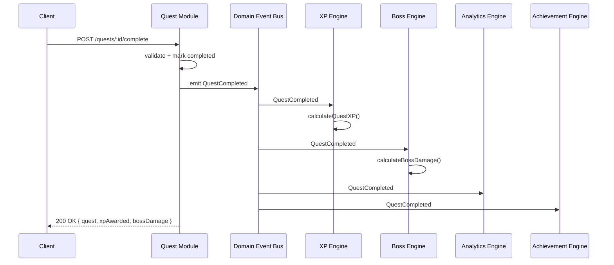

### 3.9 AI Provider Abstraction

```ts
// modules/ai/interfaces/AIProvider.ts
interface AIProvider {
  generatePlan(input: PlanningContext): Promise<AIPlanDraft>;
  triageInboxItem(item: InboxItem): Promise<TriageSuggestion>;
  summarizeReflection(context: ReflectionContext): Promise<string>;
  parseNaturalLanguageQuest(text: string): Promise<ParsedQuestDraft>;
}
// Concrete: OpenAIProvider, GeminiProvider, ClaudeProvider implement AIProvider.
// Selected via AI_PROVIDER env var; business logic depends only on AIProvider.
```

Business logic (AI Planner module, AI Coach module, Inbox module) depends only on the `AIProvider` interface, resolved via dependency injection. Swapping vendors requires changes only inside `modules/ai/providers/`.

### 3.10 Integration Abstraction

```ts
interface ExternalIntegration {
  connect(userId: string, authCode: string): Promise<IntegrationConnection>;
  disconnect(userId: string): Promise<void>;
  push(userId: string, payload: unknown): Promise<void>;
  pull(userId: string): Promise<unknown[]>;
}
// Concrete: NotionIntegration, GoogleCalendarIntegration, HealthConnectIntegration
```

### 3.11 Sync Engine Architecture

Responsibilities: detect connectivity changes; queue offline events; retry with exponential backoff; detect and drop duplicate events (idempotency via `eventId`); resolve conflicts per entity-specific strategy; maintain a per-object `syncStatus`. See Section 7 for the full event catalog and conflict-resolution table.

### 3.12 Security Architecture

- **Authentication:** JWT access token (short-lived, ~15 min) + refresh token (long-lived, rotated on use, stored httpOnly/secure on any web surface and in secure device storage on mobile).
- **Authorization:** Role-Based Access Control at the account level (`user`, `admin`); all resource access additionally scoped by `userId` ownership checks in every repository query.
- **Zero client trust:** the backend MUST NOT accept client-submitted XP, level, Mana, Energy, Boss HP, streak, or achievement values as final — see Anti-Cheat Validation (Section 4.25) and design constraint C-7.
- **Encryption:** TLS 1.2+ in transit; at-rest encryption for the PostgreSQL volume and S3 bucket; sensitive fields (OAuth tokens for Notion/Google) encrypted at the application layer before storage.
- **Secrets:** managed via environment configuration / secret manager, never committed to source.
- **Logging & Monitoring:** structured request logging, error tracking, and audit logging of all progression-affecting events (tied to the Event Sourcing store, Section 3.13).

### 3.13 Deployment Architecture

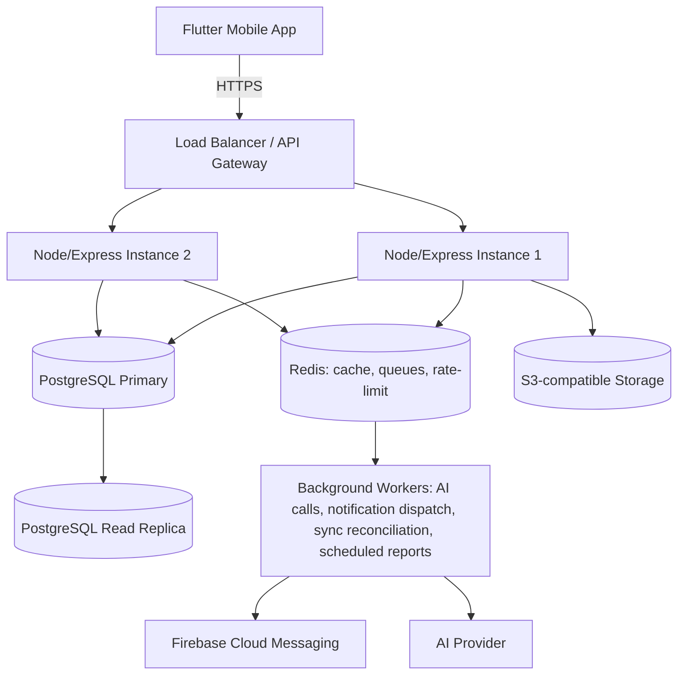

Background workers (BullMQ over Redis) handle anything that should not block a request/response cycle: AI plan generation, monthly report aggregation, streak/decay cron jobs, push notification dispatch, and sync-conflict reconciliation retries.

---

## 4. Functional Requirements

Each module below states purpose, then numbered functional requirements. All progression-value requirements are subject to design constraint C-7 (backend-authoritative validation).

### 4.1 Authentication (`modules/auth`)

| ID | Requirement |
|---|---|
| FR-AUTH-1 | The system SHALL support account creation via email/password and MAY support OAuth (Google/Apple) sign-in. |
| FR-AUTH-2 | The system SHALL issue a short-lived JWT access token and a rotating refresh token on successful login. |
| FR-AUTH-3 | The system SHALL allow the client to refresh an expired access token using a valid refresh token, without re-entering credentials. |
| FR-AUTH-4 | The system SHALL support logout, invalidating the refresh token. |
| FR-AUTH-5 | The system SHALL support password reset via email verification. |
| FR-AUTH-6 | The system SHALL allow local (offline) session continuity using the last valid access token until it expires, after which protected write-sync operations queue until reconnection. |

### 4.2 Character (`modules/character`)

| ID | Requirement |
|---|---|
| FR-CHAR-1 | Each user account SHALL own exactly one Character. |
| FR-CHAR-2 | The Character SHALL expose: Level, current XP, XP-to-next-level, Mana, Energy, Coins, Gems, Titles (unlocked + equipped), Rank, and a set of Stats (Strength, Intelligence, Discipline, Creativity, Fitness, Coding, Business, Health — configurable list). |
| FR-CHAR-3 | Stats SHALL increase only as a computed side effect of tagged Quest/Habit completions (e.g., a Quest tagged `fitness` contributes to the Fitness stat), via the XP Engine, never via direct client write. |
| FR-CHAR-4 | The system SHALL allow the user to equip one unlocked Title at a time for display. |
| FR-CHAR-5 | Character state changes SHALL always originate from a domain event (QuestCompleted, GateCompleted, etc.), never from a direct "set stat" API. |

### 4.3 XP Engine (`modules/xp`)

| ID | Requirement |
|---|---|
| FR-XP-1 | The XP Engine SHALL compute XP awards as a function of Quest/Habit difficulty, estimated duration, consistency (streak), and focus quality (Gate outcome). |
| FR-XP-2 | The XP Engine SHALL expose a configurable Level Curve (XP required per level) loaded from configuration, not hardcoded. |
| FR-XP-3 | The system SHALL persist every XP change as an immutable `xp_transactions` record referencing its triggering event. |
| FR-XP-4 | The client MAY display a locally predicted ("pending") XP value immediately on quest completion, which SHALL be reconciled against the backend's authoritative value upon sync. |

### 4.4 Mana Engine (`modules/mana`)

| ID | Requirement |
|---|---|
| FR-MANA-1 | Mana SHALL decrease based on: high-distraction screen time, failed Gate sessions, missed Quest deadlines. |
| FR-MANA-2 | Mana SHALL increase based on: completed Quests, successful Gate sessions, logged exercise, logged sleep. |
| FR-MANA-3 | The AI Coach and AI Planner SHALL factor current Mana into scheduling/workload recommendations. |
| FR-MANA-4 | Mana SHALL never fall below a configurable floor (default 0) nor exceed a configurable ceiling. |

### 4.5 Energy Engine (`modules/energy`)

| ID | Requirement |
|---|---|
| FR-ENERGY-1 | The user SHALL be able to select a circadian profile: Early Bird, Night Owl, or Custom. |
| FR-ENERGY-2 | The Energy Engine SHALL compute an intraday energy curve from the selected profile. |
| FR-ENERGY-3 | The AI Planner/Coach SHALL prefer scheduling high-difficulty Quests during predicted high-energy windows. |
| FR-ENERGY-4 | Mana depletion rate SHALL vary with the current point on the Energy curve. |

### 4.6 Quest (`modules/quests`)

| ID | Requirement |
|---|---|
| FR-QUEST-1 | The system SHALL support Quest types: Daily, Main, Side, Recurring, Boss Quest, AI-Generated. |
| FR-QUEST-2 | Quests SHALL support fields: title, description, priority, difficulty, deadline, estimated duration, XP reward (computed), Mana reward (computed), tags, category, status, parent Quest (for nesting). |
| FR-QUEST-3 | Quests SHALL support unlimited nesting depth into Subquests. |
| FR-QUEST-4 | The system SHALL support Quest Dependencies: a Quest MAY declare prerequisite Quest(s) that must be completed before it becomes actionable. |
| FR-QUEST-5 | The system SHALL support Smart Recurrence rules beyond fixed weekday patterns: every N days, "every second Tuesday," monthly, "after completion" (recur N days after last completion), "when skipped" (reschedule), and a custom cron-like expression. |
| FR-QUEST-6 | The system SHALL record Estimated Duration vs. Actual Duration per Quest and feed this into the AI's per-category speed model (see 4.9). |
| FR-QUEST-7 | The system SHALL support an Eisenhower quadrant tag (Urgent/Important combinations), settable manually or suggested by AI. |
| FR-QUEST-8 | The system SHALL support multiple views over the same Quest data: List, Kanban (Todo/Doing/Done or custom columns), Calendar, Timeline, Agenda. |
| FR-QUEST-9 | The system SHALL support drag-and-drop reassignment of a Quest's day, Kanban column, parent Boss, or parent Dungeon. |
| FR-QUEST-10 | The system SHALL support Tags, color labels, Favorites, Pin, Duplicate, Bulk Edit, Bulk Complete, Archive, Trash (soft delete), and Restore from Trash. |
| FR-QUEST-11 | The system SHALL support Undo for the most recent destructive or completion action (delete, complete, bulk-edit) within a reasonable time window (default 10s client-side, plus Restore-from-Trash indefinitely). |
| FR-QUEST-12 | Completing a Quest SHALL emit a `QuestCompleted` domain event carrying enough payload for XP, Boss, Analytics, and Achievement engines to react independently. |
| FR-QUEST-13 | A Quest with unmet dependencies SHALL be visibly locked and SHALL NOT be completable until prerequisites are satisfied. |

### 4.7 Habit (`modules/habits`) — *promoted from backlog as MVP-critical*

| ID | Requirement |
|---|---|
| FR-HABIT-1 | The system SHALL support Habits as a distinct entity from Quests: repeated indefinitely rather than finished once. |
| FR-HABIT-2 | Habits SHALL support: frequency (daily, N times/week, custom), streak tracking, XP reward, reminder time(s), skip allowance (configurable grace count before a streak breaks), and statistics (completion rate, longest streak). |
| FR-HABIT-3 | The Habit Engine SHALL compute streak continuity, applying skip allowance before breaking a streak. |
| FR-HABIT-4 | Logging a Habit completion SHALL emit a `HabitCompleted` event consumed by the XP Engine and Analytics Engine. |
| FR-HABIT-5 | The system SHALL support a Daily/Evening/Night/Study/Gym Routine Builder: an ordered sequence of Habits/Quests grouped and completed as a checklist block. |

### 4.8 Inbox & Quick Capture (`modules/inbox`) — *promoted from backlog as MVP-critical ("the one feature you're missing most")*

| ID | Requirement |
|---|---|
| FR-INBOX-1 | The system SHALL provide a single-tap Quick Capture entry point accepting text, voice-to-text, photo, or screenshot, saved unsorted to the Inbox. |
| FR-INBOX-2 | Inbox items SHALL persist fully offline and sync opportunistically. |
| FR-INBOX-3 | The system SHALL provide AI Triage: on request (or automatically on next online session), the AI SHALL propose a destination per Inbox item — new Quest, new Note, subtask under an existing Boss, or a scheduled item with a suggested date/time. |
| FR-INBOX-4 | The user MUST approve or edit each AI Triage suggestion before it converts into a Quest/Note/etc.; the AI SHALL NOT silently convert Inbox items. |
| FR-INBOX-5 | The Inbox SHALL show an unsorted-item count badge to encourage regular triage. |

### 4.9 Natural Language Quest Input (`modules/ai_planner` sub-capability)

| ID | Requirement |
|---|---|
| FR-NLI-1 | The system SHALL accept a single free-text line (e.g., "Study OS tomorrow 8pm for 2 hours") and parse it into a structured Quest draft (title, deadline, duration, suggested priority). |
| FR-NLI-2 | The parsed draft SHALL be presented for user confirmation before creation. |
| FR-NLI-3 | The parser SHALL use the AI Provider Abstraction (Section 3.9), not a hardcoded vendor call. |

### 4.10 AI Quest Planner (`modules/ai_planner`) — flagship feature

| ID | Requirement |
|---|---|
| FR-AIPLAN-1 | The user SHALL be able to submit free-form planning context (goal, deadline, constraints, available time/day, current proficiency). |
| FR-AIPLAN-2 | The AI SHALL generate a draft plan: Main Quests, Subquests, time estimates, priorities, a recommended schedule, XP rewards, and dependencies between generated Quests. |
| FR-AIPLAN-3 | The generated plan SHALL remain fully editable (add/remove/reorder/re-time any generated item) before activation. |
| FR-AIPLAN-4 | The plan SHALL NOT become active (i.e., SHALL NOT create real Quests) until the user explicitly approves it (design constraint C-10). |
| FR-AIPLAN-5 | The AI SHALL incorporate the user's learned per-category speed model (Section 4.6 FR-QUEST-6 data) when estimating durations. |
| FR-AIPLAN-6 | If the network/AI provider is unavailable, the system SHALL inform the user gracefully and allow manual Quest creation as a fallback; previously AI-generated content remains accessible offline. |

### 4.11 Boss (`modules/boss`)

| ID | Requirement |
|---|---|
| FR-BOSS-1 | A Boss SHALL represent a project with fields: HP, Difficulty, Rewards, Deadline, and its related Quests. |
| FR-BOSS-2 | Completing a related Quest SHALL damage the Boss's HP via the Boss Engine's `calculateBossDamage`. |
| FR-BOSS-3 | When Boss HP reaches zero, the system SHALL mark the Boss Defeated and emit a `BossDefeated` event. |
| FR-BOSS-4 | In Hardcore Difficulty Mode, a missed deadline or failed Gate tied to a Boss Quest MAY trigger partial Boss HP recovery (regression), per configuration. |

### 4.12 Dungeon (`modules/dungeon`)

| ID | Requirement |
|---|---|
| FR-DUNGEON-1 | A Dungeon SHALL group multiple related Bosses (e.g., a semester grouping several course Bosses). |
| FR-DUNGEON-2 | Dungeon completion SHALL be computed as all child Bosses Defeated. |

### 4.13 Gate Focus (`modules/gate`)

| ID | Requirement |
|---|---|
| FR-GATE-1 | The user SHALL select a Quest and a duration, then "enter a Gate" to begin a focus session. |
| FR-GATE-2 | During a session, the Gate Engine SHALL compute a rising Stability value as the session progresses uninterrupted. |
| FR-GATE-3 | Exiting before completion SHALL destabilize and, past a threshold, collapse the Gate, applying configurable XP/Mana penalties and, in Hardcore Mode, possible Boss HP recovery. |
| FR-GATE-4 | The session UI SHALL display: current Quest, remaining time, Mana, background music control, and the Gate Stability Orb — nothing else (minimalism requirement). |
| FR-GATE-5 | The system SHALL track Gate Success Rate, Longest Expedition, Total Gates Cleared, and Gate Collapse Count. |
| FR-GATE-6 | Gate sessions SHALL function fully offline, storing start time, end time, duration, linked Quest, pause count, exit reason, and completion status locally, then syncing for backend validation (see Section 4.25). |

### 4.14 Screen Time Intelligence (`modules/screen_time`)

| ID | Requirement |
|---|---|
| FR-SCREEN-1 | The system SHALL record per-app usage duration (platform APIs permitting) and categorize each app: Productive, Educational, Communication, Entertainment, High Distraction. |
| FR-SCREEN-2 | Each app category (and optionally each app) SHALL have a configurable Mana modifier (e.g., VS Code +2, Instagram −8). |
| FR-SCREEN-3 | The system SHALL surface peak distraction periods, most-distracting apps, most-productive apps, app-switching frequency, and focus interruption counts. |
| FR-SCREEN-4 | The AI SHALL generate actionable recommendations from this data, not statistics alone (e.g., "move your Gate sessions before 7pm"). |

### 4.15 Reminder Engine (`modules/reminders`)

| ID | Requirement |
|---|---|
| FR-REM-1 | The system SHALL support Quest/Habit/deadline reminders, plus general wellness reminders (hydration, medication, sleep, and optionally prayer). |
| FR-REM-2 | The system SHALL support user-defined Behavioral Reminders with a trigger phrase and an intervention message (e.g., delaying a compulsive action by a set number of minutes). |
| FR-REM-3 | Reminder scheduling SHALL use native OS scheduling and SHALL NOT require an active network connection to fire. |
| FR-REM-4 | The Reminder Engine SHALL throttle/consolidate notifications to avoid overwhelming the user (no more than a configurable max per time window, batched where reasonable). |

### 4.16 AI Coach (`modules/ai_coach`)

| ID | Requirement |
|---|---|
| FR-COACH-1 | The system SHALL provide AI-assisted Daily Planning: given the user's stated availability, propose a schedule for the day's Quests. |
| FR-COACH-2 | The system SHALL provide a Weekly Review flow (what went well / what didn't / goals for next week) and a Monthly Reflection distinct from the Weekly Review. |
| FR-COACH-3 | The AI SHALL detect Overload (planned workload exceeding a realistic daily capacity) and propose rebalancing. |
| FR-COACH-4 | The AI SHALL detect repeated postponement of the same Quest and proactively offer help (break it down, reschedule, reduce scope). |
| FR-COACH-5 | The AI SHALL propose Rescheduling when a deadline is missed, subject to user approval. |
| FR-COACH-6 | The system SHALL maintain an AI Memory of the user's preferred study times, favorite session durations, subjects, and working speed, to personalize future planning (see also Section 11). |

### 4.17 Notes (`modules/notes`)

| ID | Requirement |
|---|---|
| FR-NOTES-1 | The system SHALL support Notes organized into Folders and Tags, full-text searchable. |
| FR-NOTES-2 | The system SHALL support Quick Notes for fast capture, syncing to the Notes module (or Inbox, if untriaged). |
| FR-NOTES-3 | The user SHALL be able to select individual Notes to sync to a chosen Notion page via the Notion integration. |
| FR-NOTES-4 | Notes SHALL be fully editable offline; sync occurs automatically on reconnection with a manual conflict-resolution flow (Section 7). |

### 4.18 Analytics & Reports (`modules/analytics`)

| ID | Requirement |
|---|---|
| FR-ANALYTICS-1 | The system SHALL generate Daily, Weekly, Monthly, and Yearly reports covering XP, Focus time, Mana, Energy, Screen Time, Quest completion rate, Boss progress, Gate success rate, Study time, and Fitness. |
| FR-ANALYTICS-2 | The AI SHALL generate a narrative Monthly Summary (e.g., completion rate, peak productivity window, notable screen-time shifts, Gate success trend, one concrete recommendation). |
| FR-ANALYTICS-3 | Monthly reports SHALL remain permanently accessible (not purged). |
| FR-ANALYTICS-4 | Analytics SHALL be computable locally offline from cached data and reconciled with backend-aggregated analytics once synced, with the backend's aggregation authoritative. |

### 4.19 Fitness (`modules/fitness`)

| ID | Requirement |
|---|---|
| FR-FIT-1 | The system SHALL track Steps, Weight, Water Intake, Exercise sessions, Sleep, Calories, and (where available) Heart Rate. |
| FR-FIT-2 | Logged fitness activity SHALL contribute to Character Stats (e.g., Fitness, Health) and Mana recovery via the relevant engines. |
| FR-FIT-3 | The system SHALL support syncing from Google Health Connect / Apple Health where the platform permits. |

### 4.20 Calendar (`modules/calendar`)

| ID | Requirement |
|---|---|
| FR-CAL-1 | The system SHALL render Quests/Gate sessions/Habits with due times on a calendar view. |
| FR-CAL-2 | The system SHALL support two-way sync with Google Calendar via the Integration Abstraction. |

### 4.21 Music & Brain Reset (`modules/music`)

| ID | Requirement |
|---|---|
| FR-MUSIC-1 | The system SHALL provide built-in focus audio: Lo-fi, Rain, Brown/White/Pink Noise, Nature, Cafe Ambience, Fantasy Ambience. |
| FR-MUSIC-2 | Playback SHALL continue while the app is minimized, subject to platform background-audio limitations. |
| FR-MUSIC-3 | The system SHALL provide a Brain Reset feature (e.g., 852 Hz tones, relaxation sounds, guided breathing) usable between sessions. |

### 4.22 Notifications (`modules/notifications`)

| ID | Requirement |
|---|---|
| FR-NOTIF-1 | The system SHALL dispatch push notifications via FCM for reminders, AI Coach nudges, and sync-conflict alerts requiring user input. |
| FR-NOTIF-2 | The system SHALL maintain an in-app Notification Center with read/unread state. |

### 4.23 Settings (`modules/settings`)

| ID | Requirement |
|---|---|
| FR-SET-1 | The system SHALL allow switching between Casual Mode and Hardcore RPG Mode (Section 4.26). |
| FR-SET-2 | The system SHALL allow configuring circadian profile, notification preferences, and integration connections. |
| FR-SET-3 | The system SHALL support data Export/Import (JSON/CSV) and manual Backup trigger. |

### 4.24 Integrations (`modules/integrations`)

| ID | Requirement |
|---|---|
| FR-INT-1 | The system SHALL support connecting/disconnecting Notion, Google Calendar, and Health Connect/Apple Health accounts via OAuth, through the Integration Abstraction. |
| FR-INT-2 | Integration credentials SHALL be stored encrypted and scoped per user. |

### 4.25 Search Everywhere (`modules/search`)

| ID | Requirement |
|---|---|
| FR-SEARCH-1 | The system SHALL provide a single global search across Quests, Bosses, Dungeons, Habits, Notes, Achievements, Projects, and Settings. |
| FR-SEARCH-2 | Search SHALL work offline against the local database, with results limited to locally-synced data. |

### 4.26 Difficulty Modes

| ID | Requirement |
|---|---|
| FR-DIFF-1 | Casual Mode SHALL apply small penalties, high AI assistance, gentle progression curve, and guided onboarding. |
| FR-DIFF-2 | Hardcore RPG Mode SHALL apply higher rewards, larger penalties, Boss HP recovery on failure, Gate collapse consequences, and minimal AI hand-holding. |
| FR-DIFF-3 | Difficulty Mode SHALL be a per-user setting affecting Game Engine parameters via configuration, not separate code paths. |

### 4.27 Sync & Offline Behavior (`modules/sync`) — cross-cutting, see also Sections 3.11 and 7

| ID | Requirement |
|---|---|
| FR-SYNC-1 | Every mutating client action SHALL write to the local database immediately and enqueue a corresponding domain event for sync, without waiting on network response. |
| FR-SYNC-2 | The Sync Engine SHALL detect connectivity changes and automatically flush the queue when back online. |
| FR-SYNC-3 | The Sync Engine SHALL retry failed sync attempts with exponential backoff and SHALL deduplicate by event ID. |
| FR-SYNC-4 | Every syncable object SHALL expose a `syncStatus` (Synced/Pending/Syncing/Failed/Conflict) surfaced subtly in the UI. |
| FR-SYNC-5 | The backend SHALL validate every incoming event and MAY reject/flag it (Section 4.28) before it becomes authoritative; on rejection, the client SHALL reconcile to the authoritative state and surface a non-blocking notice if the user-visible result changed. |

### 4.28 Backend Authority & Anti-Cheat Validation (`modules/xp`, `modules/gate`, `modules/boss`, cross-cutting)

| ID | Requirement |
|---|---|
| FR-VALID-1 | The backend SHALL recompute XP, Level, Mana, Energy, Boss damage, streaks, and achievement unlocks from raw events; it SHALL NOT accept client-submitted final values for these fields. |
| FR-VALID-2 | The backend SHALL reject or flag events exhibiting: impossible Gate durations, unrealistic XP gains, duplicate event IDs, timestamps inconsistent with device clock drift bounds, impossible completion rates, duplicate rewards, or replay of a previously-processed event. |
| FR-VALID-3 | Flagged events SHALL be held in a review state rather than silently applied or silently discarded, and SHALL be logged for audit. |

---

## 5. Non-Functional Requirements

| ID | Category | Requirement |
|---|---|---|
| NFR-PERF-1 | Performance | Local (offline) interactions SHALL complete within ~100ms perceived latency. |
| NFR-PERF-2 | Performance | Backend API p95 response time SHALL be under 300ms for non-AI endpoints under nominal load. |
| NFR-PERF-3 | Performance | AI-dependent endpoints (plan generation, triage, reflection) SHALL respond asynchronously (job + polling or websocket push) rather than holding an HTTP connection open indefinitely. |
| NFR-REL-1 | Reliability | No user data SHALL be lost due to temporary connectivity loss; the local event queue SHALL persist across app restarts/crashes. |
| NFR-REL-2 | Reliability | Synchronization SHALL be resilient to crashes and interruptions mid-sync (resumable, idempotent). |
| NFR-SCALE-1 | Scalability | The event synchronization pipeline SHALL be designed to scale horizontally (stateless API instances behind a load balancer, queue-backed workers) to support growth toward millions of users. |
| NFR-MAINT-1 | Maintainability | Synchronization logic SHALL be modular and independently testable from feature business logic. |
| NFR-MAINT-2 | Maintainability | Every backend module and frontend feature SHALL contain a README documenting purpose, public API, dependencies, DB tables, events, and extension points. |
| NFR-SEC-1 | Security | Client-generated progression data MUST always be validated by the backend before becoming authoritative (see FR-VALID-1). |
| NFR-SEC-2 | Security | All traffic SHALL use TLS; all sensitive data at rest SHALL be encrypted. |
| NFR-SEC-3 | Security | The system SHALL implement Role-Based Access Control and per-resource ownership checks. |
| NFR-ACC-1 | Accessibility | The UI SHALL meet baseline mobile accessibility guidelines (sufficient contrast, scalable text, screen-reader labels on primary interactive elements). |
| NFR-OFFLINE-1 | Offline Support | Nearly all productivity actions SHALL function fully offline, per Section 3.2 and 4.27. |
| NFR-PRIV-1 | Data Privacy | The system SHALL allow users to export and delete their data (right to portability/erasure). |
| NFR-LOG-1 | Logging/Monitoring | All API errors and all progression-affecting events SHALL be logged with correlation IDs for traceability. |
| NFR-API-1 | API Versioning | The API SHALL be versioned under `/api/v1/` to allow non-breaking evolution. |
| NFR-CACHE-1 | Caching | Frequently-read, slow-to-compute aggregates (e.g., monthly analytics) SHALL be cached in Redis with explicit invalidation on relevant events. |
| NFR-SYNC-1 | Synchronization | Sync SHALL occur asynchronously and SHALL NOT block UI interaction (see NFR-PERF-1). |

---

## 6. Data Model & Database Design

### 6.1 Entity-Relationship Diagram (core entities)

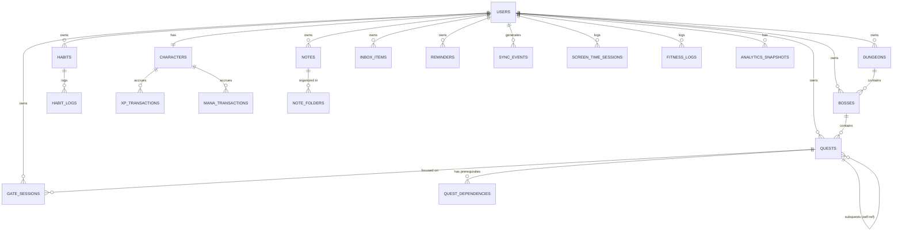

### 6.2 Key Table Schemas (PostgreSQL — authoritative)

```
users
  id UUID PK, email, password_hash, created_at, updated_at, difficulty_mode

characters
  id UUID PK, user_id FK -> users.id (unique), level, total_xp, mana, energy,
  coins, gems, active_title_id, rank, stats JSONB, updated_at

quests
  id UUID PK, user_id FK, boss_id FK NULL, parent_quest_id FK NULL (self-ref),
  title, description, quest_type ENUM(daily,main,side,recurring,boss,ai_generated),
  priority, difficulty, deadline TIMESTAMPTZ NULL, estimated_minutes, actual_minutes NULL,
  status ENUM(active,in_progress,completed,archived,trashed), eisenhower_quadrant NULL,
  recurrence_rule JSONB NULL, tags TEXT[], is_favorite BOOL, is_pinned BOOL,
  created_at, updated_at, completed_at NULL

quest_dependencies
  id UUID PK, quest_id FK, depends_on_quest_id FK

habits
  id UUID PK, user_id FK, title, frequency JSONB, skip_allowance INT,
  current_streak INT, longest_streak INT, reminder_times TIME[], created_at

habit_logs
  id UUID PK, habit_id FK, completed_at TIMESTAMPTZ, skipped BOOL

bosses
  id UUID PK, user_id FK, dungeon_id FK NULL, title, hp_max, hp_current,
  difficulty, deadline NULL, status ENUM(active,defeated), created_at

dungeons
  id UUID PK, user_id FK, title, status ENUM(active,completed), created_at

gate_sessions
  id UUID PK, user_id FK, quest_id FK NULL, started_at, ended_at NULL,
  planned_duration_s, actual_duration_s NULL, pause_count INT,
  exit_reason NULL, status ENUM(in_progress,completed,collapsed),
  stability_final NUMERIC NULL, xp_awarded NULL, mana_delta NULL, device_id, client_event_id UNIQUE

xp_transactions
  id UUID PK, character_id FK, amount, source_event_type, source_event_id,
  created_at

mana_transactions
  id UUID PK, character_id FK, delta, source_event_type, source_event_id, created_at

screen_time_sessions
  id UUID PK, user_id FK, app_package, category, duration_s, occurred_at, mana_modifier_applied

inbox_items
  id UUID PK, user_id FK, raw_content, capture_type ENUM(text,voice,photo,screenshot),
  status ENUM(unsorted,triaged,converted), ai_suggested_destination JSONB NULL,
  created_at

notes
  id UUID PK, user_id FK, folder_id FK NULL, title, body, tags TEXT[],
  notion_page_id NULL, sync_status, created_at, updated_at

reminders
  id UUID PK, user_id FK, type ENUM(quest,habit,deadline,wellness,behavioral),
  trigger_config JSONB, message, active BOOL

analytics_snapshots
  id UUID PK, user_id FK, period ENUM(daily,weekly,monthly,yearly), period_start,
  metrics JSONB, ai_summary TEXT NULL, created_at

sync_events   -- backend-side mirror of the client event queue; also the Event Sourcing log
  id UUID PK, user_id FK, device_id, event_type, payload JSONB, occurred_at_client,
  received_at_server, sync_status ENUM(pending,syncing,synced,failed,conflict,cancelled),
  retry_count INT, version INT
```

### 6.3 Local (Client) Database

The local database (SQLite via Drift, or Isar) mirrors the backend's user-scoped tables (`quests`, `habits`, `bosses`, `dungeons`, `notes`, `gate_sessions`, `reminders`, `inbox_items`, `screen_time_sessions`, `fitness_logs`, plus a cached, read-mostly copy of `characters` and `analytics_snapshots`) and additionally owns a `local_event_queue` table with the shape described in Section 7.2. Every locally-mutable table carries a `sync_status` column mirroring the states in Section 7.

---

## 7. Event Catalog & Synchronization Specification

### 7.1 Domain Event Catalog

| Event | Trigger | Key Payload Fields | Consumers |
|---|---|---|---|
| `QuestCreated` | User/AI creates a Quest | questId, title, type, parentId, bossId | Search, Analytics |
| `QuestEdited` | Any Quest field changes | questId, changedFields | Search, Analytics |
| `QuestCompleted` | User marks Quest done | questId, difficulty, durationActual, bossId, tags | XP, Boss, Analytics, Achievement, Habit(if linked) |
| `QuestDeleted` | User trashes/permanently deletes | questId, softDelete(bool) | Search, Analytics |
| `HabitCompleted` | User logs a Habit occurrence | habitId, streakBefore | XP, Mana, Analytics |
| `HabitSkipped` | User uses skip allowance | habitId | Analytics |
| `GateEntered` | User starts a Gate session | sessionId, questId, plannedDuration | Analytics |
| `GateCompleted` | Session finishes successfully | sessionId, actualDuration, stabilityFinal | XP, Mana, Analytics |
| `GateCollapsed` | Session exited early past threshold | sessionId, exitReason | XP(penalty), Mana(penalty), Boss(possible recovery), Analytics |
| `BossDamaged` | Related Quest completed | bossId, damage, hpRemaining | Analytics, Achievement |
| `BossDefeated` | Boss HP reaches 0 | bossId | Character(title/rank), Analytics, Achievement |
| `ReminderCompleted` | User acknowledges a reminder | reminderId | Analytics |
| `ScreenTimeRecorded` | App usage session logged | appPackage, durationS, category | Mana, Analytics |
| `NoteCreated` / `NoteEdited` | Note CRUD | noteId | Search, Integrations(Notion) |
| `InboxItemCaptured` | Quick Capture used | inboxItemId, captureType | AI Triage queue |
| `InboxItemTriaged` | AI suggestion approved | inboxItemId, destinationType, destinationId | Quest/Note/Boss module |

### 7.2 Local Event Queue Record

```
local_event_queue
  event_id UUID (client-generated, globally unique) PK
  user_id
  event_type
  payload JSONB
  device_id
  occurred_at_client TIMESTAMPTZ
  sync_status ENUM(pending,syncing,synced,failed,conflict,cancelled)
  retry_count INT DEFAULT 0
  version INT
```

Event states: **Pending** (queued, not yet sent) → **Syncing** (in-flight) → **Synced** (backend acknowered + authoritative result applied) | **Failed** (retry with backoff) | **Conflict** (needs resolution per Section 7.3) | **Cancelled** (superseded by a later local event, e.g., a create immediately followed by a delete before ever syncing).

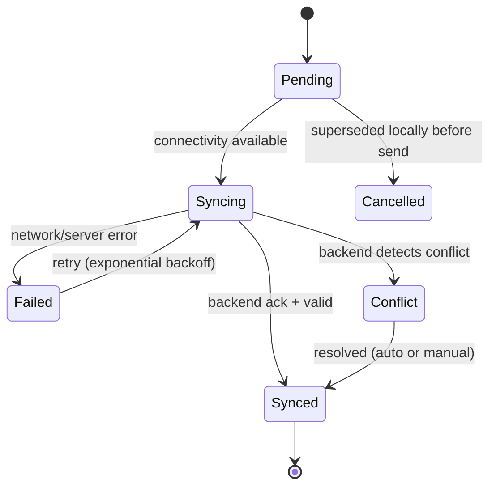

Retry policy: exponential backoff starting at 2s, doubling to a max of 5 minutes, capped at a configurable max retry count before surfacing a manual "sync failed" indicator to the user; duplicate `event_id`s are rejected server-side as idempotency keys.

### 7.3 Conflict Resolution Strategy by Entity

| Entity | Strategy |
|---|---|
| Quest (title/description/tags) | Field-level merge where possible; last-write-wins per field otherwise |
| Quest completion / deletion | Server-authoritative: once completed/deleted on the server, offline edits from a stale client are rejected and the client reconciles |
| Notes | Manual conflict resolution UI (show both versions, let user merge) — content is user-authored prose, not safe to auto-merge |
| Character progression (XP, Mana, Level, Boss HP, streaks) | Server authority always wins; client value is only ever a "pending" prediction (Section 3.12, FR-VALID-1) |
| Gate sessions | Server-validated on sync (Section 4.28); rejected sessions revert to an "invalid" status with an explanatory client notice |
| Settings | Last-write-wins by timestamp |

### 7.4 Verified vs. Pending Data

Any client-displayed progression value (XP, Boss HP, achievement unlock) SHALL be tagged internally as **Pending** (locally predicted, optimistic) or **Verified** (confirmed by backend), so the UI can, if desired, subtly distinguish them (e.g., a slightly muted color for Pending) without blocking interaction.

---

## 8. API Specification

Base path: `/api/v1`. All endpoints (except `/auth/*`) require a valid JWT bearer token. Standard responses use `{ data, error, meta }` envelopes; list endpoints support `?page&pageSize&updatedSince` for incremental sync pulls.

### 8.1 Auth

| Method | Path | Description |
|---|---|---|
| POST | `/auth/signup` | Create account |
| POST | `/auth/login` | Obtain access + refresh token |
| POST | `/auth/refresh` | Exchange refresh token for new access token |
| POST | `/auth/logout` | Invalidate refresh token |
| POST | `/auth/password-reset/request` | Start password reset |
| POST | `/auth/password-reset/confirm` | Complete password reset |

### 8.2 Character

| Method | Path | Description |
|---|---|---|
| GET | `/character` | Get current user's character |
| GET | `/character/stats` | Get stat breakdown |
| PATCH | `/character/title` | Equip an unlocked title |

### 8.3 Quests

| Method | Path | Description |
|---|---|---|
| GET | `/quests` | List quests (filterable by status, tag, boss, date range; view-aware) |
| POST | `/quests` | Create a quest |
| GET | `/quests/:id` | Get a quest (incl. subquests, dependencies) |
| PATCH | `/quests/:id` | Edit a quest |
| POST | `/quests/:id/complete` | Complete a quest (emits `QuestCompleted`) |
| DELETE | `/quests/:id` | Soft-delete (trash) a quest |
| POST | `/quests/:id/restore` | Restore from trash |
| POST | `/quests/bulk` | Bulk edit/complete/archive |
| POST | `/quests/parse-nl` | Parse natural-language quest text into a draft |
| POST | `/quests/:id/dependencies` | Add a prerequisite |

### 8.4 Habits

| Method | Path | Description |
|---|---|---|
| GET | `/habits` | List habits |
| POST | `/habits` | Create a habit |
| PATCH | `/habits/:id` | Edit a habit |
| POST | `/habits/:id/log` | Log a completion (or skip) |
| GET | `/habits/:id/stats` | Streak/statistics |

### 8.5 Inbox

| Method | Path | Description |
|---|---|---|
| POST | `/inbox` | Quick-capture an item |
| GET | `/inbox` | List unsorted items |
| POST | `/inbox/:id/triage` | Request AI triage suggestion |
| POST | `/inbox/:id/convert` | Approve suggestion → create Quest/Note/etc. |

### 8.6 AI Planner & Coach

| Method | Path | Description |
|---|---|---|
| POST | `/ai/plan` | Submit planning context, receive a draft plan (async job) |
| GET | `/ai/plan/:jobId` | Poll/retrieve generated draft |
| POST | `/ai/plan/:jobId/approve` | Approve draft → materializes real Quests |
| POST | `/ai/coach/daily` | Request today's AI schedule proposal |
| POST | `/ai/coach/weekly-review` | Submit/request weekly review |
| GET | `/ai/coach/nudges` | Fetch current overload/procrastination nudges |

### 8.7 Boss / Dungeon

| Method | Path | Description |
|---|---|---|
| GET/POST | `/bosses` | List / create bosses |
| GET/PATCH | `/bosses/:id` | Get / edit a boss |
| GET/POST | `/dungeons` | List / create dungeons |

### 8.8 Gate

| Method | Path | Description |
|---|---|---|
| POST | `/gate/sessions` | Start a session |
| PATCH | `/gate/sessions/:id` | Update (pause/resume/exit) |
| POST | `/gate/sessions/:id/complete` | Complete, server validates + awards rewards |
| GET | `/gate/stats` | Aggregate stats |

### 8.9 Screen Time / Reminders / Notes / Fitness / Calendar / Notifications / Settings / Integrations / Search / Sync

| Method | Path | Description |
|---|---|---|
| POST | `/screen-time/sessions` | Batch-log app usage sessions |
| GET | `/screen-time/insights` | Distraction analysis |
| GET/POST | `/reminders` | List / create reminders |
| GET/POST | `/notes` | List / create notes |
| POST | `/notes/:id/sync-notion` | Push note to Notion |
| GET/POST | `/fitness/logs` | List / create fitness logs |
| GET | `/calendar/events` | Merged internal + Google Calendar view |
| GET/PATCH | `/notifications` | List / mark read |
| GET/PATCH | `/settings` | Get / update settings |
| POST | `/integrations/:provider/connect` | Start OAuth connect flow |
| DELETE | `/integrations/:provider` | Disconnect |
| GET | `/search?q=` | Cross-entity search |
| POST | `/sync/push` | Push a batch of local events |
| GET | `/sync/pull?since=` | Pull authoritative changes since a cursor/timestamp |

---

## 9. Screen Specifications & Navigation Flow

### 9.1 Bottom Navigation

Home · Quests · Gate · Progress · Profile

### 9.2 Secondary Screens

Character · Boss · Dungeon · Inventory · Skill Tree · Analytics · Reports · Fitness · Notes · Screen Time · Settings · Integrations · Notifications · AI Coach · Reminder Manager · Music · Calendar · Inbox

| Screen | Purpose |
|---|---|
| Home | Today's Quests/Habits at a glance, AI daily-plan prompt, Mana/Energy status |
| Quests | Multi-view (List/Kanban/Calendar/Timeline/Agenda) quest management |
| Gate | Start/monitor focus sessions, Stability Orb |
| Progress | Character level, XP bar, streaks, recent achievements |
| Profile | Titles, ranks, stats, settings entry point |
| Inbox | Unsorted quick captures + AI Triage queue |
| Boss / Dungeon | Project/collection views with HP and related quests |
| Analytics / Reports | Daily/weekly/monthly/yearly reports, AI narrative summary |
| Screen Time | App usage breakdown, Mana modifiers, distraction insights |
| AI Coach | Daily planning, weekly/monthly review, nudges |
| Notes | Folders, tags, Notion sync status |
| Reminder Manager | List/edit reminders incl. behavioral reminders |
| Music | Focus audio + Brain Reset |
| Fitness / Calendar / Settings / Integrations / Notifications | As named |

### 9.3 Navigation Flow

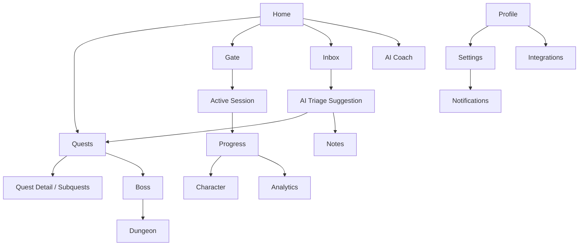

---

## 10. Behavioral Diagrams

### 10.1 Sequence — AI Quest Planner Flow

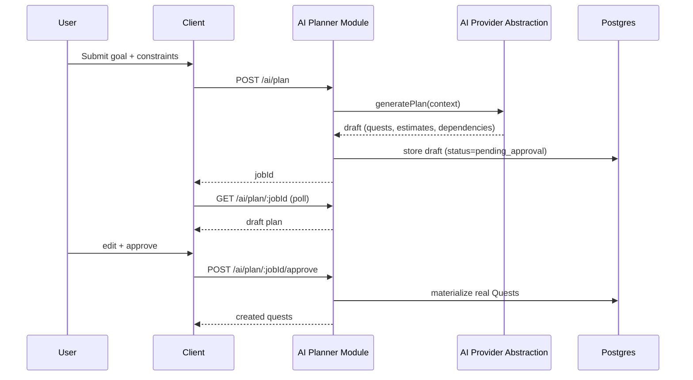

### 10.2 Sequence — Offline Quest Completion & Sync

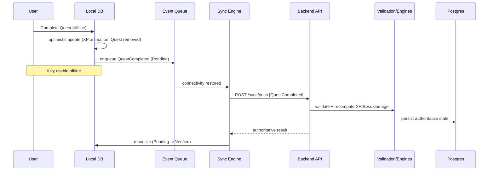

### 10.3 Activity — Gate Focus Session Lifecycle

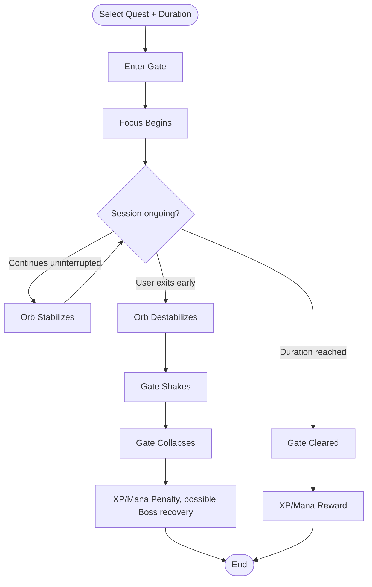

### 10.4 State — Quest Lifecycle

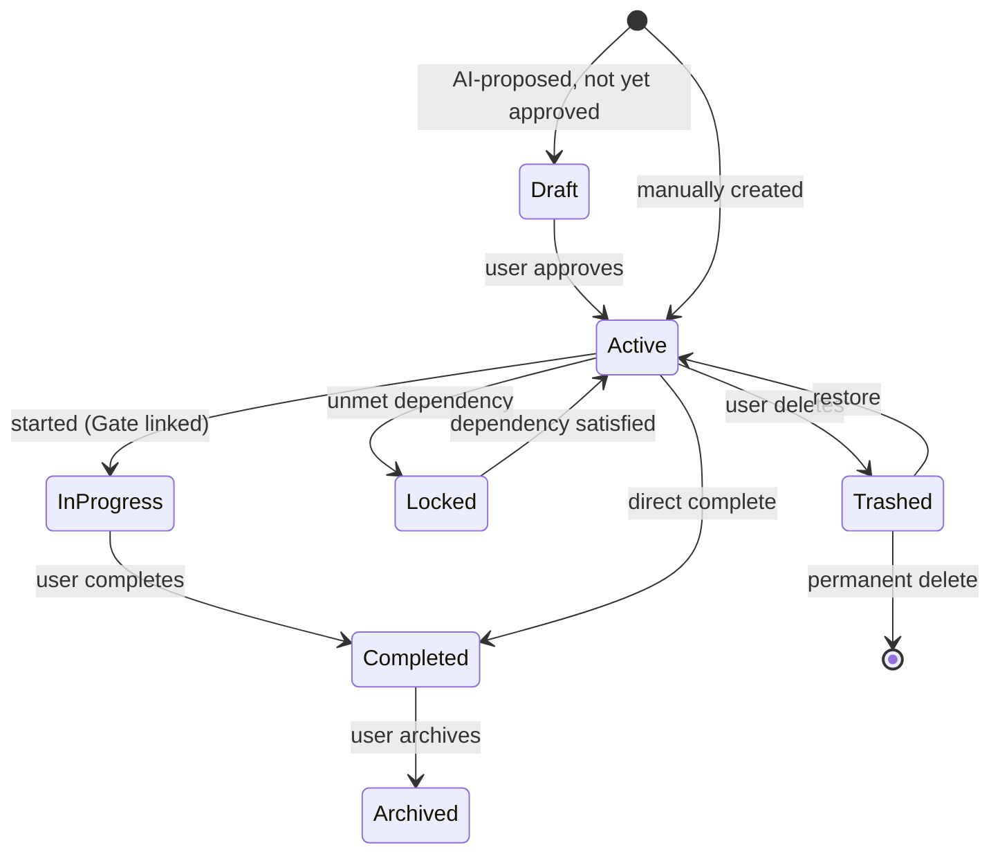

### 10.5 State — Boss Lifecycle

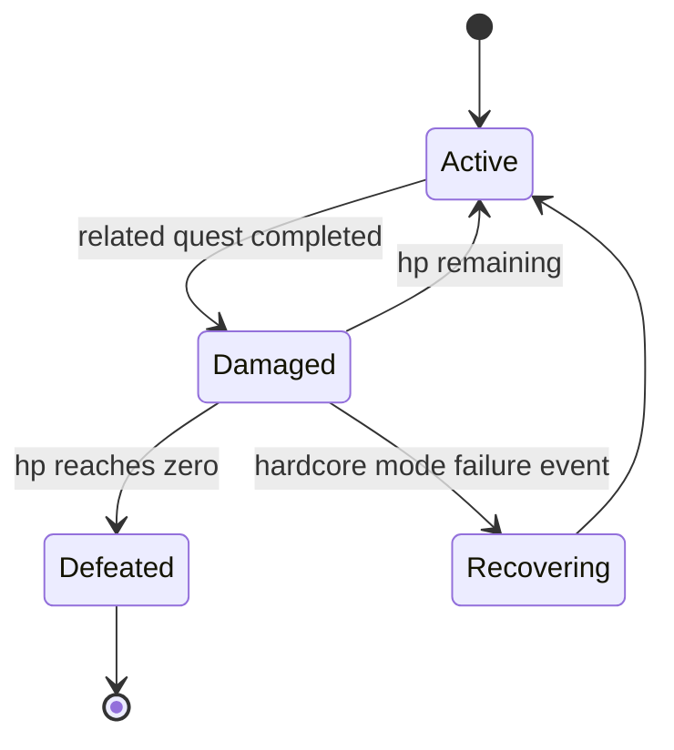

---

## 11. AI Architecture

### 11.1 Provider Abstraction (recap)

All AI capability is accessed through the `AIProvider` interface (Section 3.9). Concrete providers (`OpenAIProvider`, `GeminiProvider`, `ClaudeProvider`) are selected by configuration; business modules (AI Planner, AI Coach, Inbox Triage, Natural Language Input) depend only on the interface, never on a vendor SDK.

### 11.2 AI Quest Planner Pipeline

1. **Context assembly** — the backend assembles: user's raw planning input, relevant existing Quests/Bosses/Dungeons, the user's learned per-category speed model (Section 11.4), current Mana/Energy, and Difficulty Mode.
2. **Prompt construction** — a structured prompt requesting a JSON plan: Main Quests, Subquests, time estimates, priorities, recommended schedule, XP rewards, dependencies.
3. **Provider call** — via `AIProvider.generatePlan()`, run as a background job (not a blocking HTTP request) given potential latency.
4. **Draft persistence** — stored with `status = pending_approval`; never auto-materialized into real Quests (constraint C-10 / FR-AIPLAN-4).
5. **User review** — client renders the draft as editable Quests/Subquests; user can add, remove, re-time, re-prioritize.
6. **Approval** — on approval, the backend materializes real Quest rows and emits `QuestCreated` events per item.

### 11.3 AI Coach Flows

- **Daily Planning**: given today's available hours, propose an ordered schedule from Active Quests, weighted by deadline, priority, Eisenhower quadrant, and current Energy curve.
- **Weekly Review**: prompt the user (what went well / what didn't / goals), and, combined with Analytics, produce a short reflective summary.
- **Monthly Reflection**: distinct from Weekly Review — longer-horizon narrative pulling from `analytics_snapshots`.
- **Overload Detection**: compares total estimated-minutes scheduled today/this week against a realistic capacity model; if exceeded, proposes specific Quests to move.
- **Procrastination Detection**: flags a Quest postponed beyond a configurable threshold count and offers to break it down or reschedule.
- **Rescheduling Suggestion**: triggered on a missed deadline; proposes new dates for affected Quests, requiring user approval before applying.

### 11.4 AI Memory (Learned User Model)

The AI Coach persists a lightweight, structured "learned model" per user — **not** a black-box embedding, but explicit fields the system can reason about and the user could, in principle, inspect: preferred study/work time windows, average actual-vs-estimated duration ratio per Quest category/tag, favorite session durations, and subjects/categories worked on most. This model is built from `FR-QUEST-6` actual-duration data and Gate session history, and is fed back into `FR-AIPLAN-5` estimate calibration.

### 11.5 AI Guardrails

- The AI never writes progression-affecting state directly (XP, Level, Boss HP); it only proposes Quests/schedules, which flow through the same validated creation/completion paths as manually-created ones.
- AI-generated plans always require explicit user approval before activation (C-10).
- If the AI provider is unreachable, the system degrades gracefully to manual entry — it never blocks core productivity functionality on AI availability (FR-AIPLAN-6).

---

## 12. Use Cases

### UC-1: Generate an AI Study Plan

- **Actor:** Amara (student)
- **Preconditions:** User authenticated, online.
- **Main Flow:** User opens AI Planner → enters goal, syllabus topics, deadline, available time/day, current proficiency → submits → system returns a draft plan of Main Quests/Subquests with schedule and dependencies → user edits durations/order as needed → user approves → system creates real Quests, linked as needed to a Boss ("OS Final Exam").
- **Alternate Flow:** AI provider unavailable → system informs user, offers manual Quest creation.
- **Postconditions:** Approved Quests exist and are visible in the Quests screen and Calendar.

### UC-2: Complete a Quest Offline and Sync Later

- **Actor:** Rafi (engineer), offline (e.g., on a flight)
- **Preconditions:** App previously synced at least once; local DB has the Quest.
- **Main Flow:** User marks a Quest complete → local DB updates instantly, XP animation plays with a "Pending" indicator, Boss HP visually decreases → event enqueued locally.
- **Alternate Flow:** On reconnect, Sync Engine pushes the event; backend validates and recomputes XP/Boss damage; if the authoritative result differs from the local prediction, the client reconciles and briefly surfaces the change.
- **Postconditions:** Quest, XP, and Boss HP are marked Verified.

### UC-3: Enter and Complete a Gate Expedition

- **Actor:** Any user
- **Main Flow:** Select Quest + duration → Enter Gate → minimal focus UI shown → Stability Orb grows as time passes uninterrupted → duration reached → Gate Cleared → XP/Mana rewarded.
- **Alternate Flow:** User exits early past the destabilization threshold → Orb shakes → Gate collapses → XP/Mana penalty applied (and, in Hardcore Mode, possible Boss HP recovery).
- **Postconditions:** A `gate_sessions` record with final status; Character updated.

### UC-4: Capture an Inbox Item and AI-Triage It

- **Actor:** Any user, mid-task, no time to file it properly
- **Main Flow:** User taps Quick Capture, speaks or types a thought → saved to Inbox instantly, works offline → later, user opens Inbox → requests AI Triage → AI suggests "convert to Quest under Boss: Research Paper, schedule tomorrow evening" → user approves or edits → item converts.
- **Postconditions:** Inbox item marked converted; new Quest exists in the suggested location.

### UC-5: Weekly AI Review

- **Actor:** Dr. Lin (researcher)
- **Main Flow:** Every configured day (default Sunday), AI Coach prompts "What went well? What didn't? Goals for next week?" → user answers → system combines answers with the week's Analytics → produces a short reflective summary, stored and viewable later.
- **Postconditions:** A weekly review record exists, feeding into Monthly Reflection aggregation.

---

## 13. User Stories

| ID | Story |
|---|---|
| US-1 | As a student, I want the AI to turn my syllabus into a day-by-day plan, so I don't have to manually break it down myself. |
| US-2 | As an engineer, I want to see which apps are draining my Mana, so I know what to cut during deep-work blocks. |
| US-3 | As a researcher, I want Quests to require their prerequisites before they're actionable, so I can't accidentally skip a step in a multi-stage project. |
| US-4 | As any user, I want to capture a stray thought in one tap without deciding what it is yet, so I don't lose the idea or interrupt what I'm doing. |
| US-5 | As any user, I want my completed Quest to show up instantly even with no internet, so the app never feels broken on a flight or in a dead zone. |
| US-6 | As a habit-builder, I want my streak to survive an occasional missed day (within my skip allowance), so one bad day doesn't erase my progress. |
| US-7 | As a project owner, I want a visual Boss HP bar tied to my project's tasks, so completing work feels tangible. |
| US-8 | As a Kanban person, I want to drag a Quest between Todo/Doing/Done, so I can work the way I actually think. |
| US-9 | As a returning user, I want to undo an accidental "complete" or "delete," so a slip of the thumb doesn't cost me data. |
| US-10 | As a user who's been postponing something repeatedly, I want the AI to notice and offer to help, rather than silently let me keep avoiding it. |
| US-11 | As a Hardcore Mode player, I want real stakes (Boss HP recovery, bigger penalties) when I fail a Gate, so my progress actually means something. |
| US-12 | As a Notion user, I want to sync specific notes to a chosen Notion page, without every note being force-synced. |
| US-13 | As any user, I want one search bar that finds a Quest, a Note, or a Boss, so I don't need to remember which screen something lives in. |
| US-14 | As a fitness-minded user, I want my logged sleep and exercise to actually restore my in-app Mana, so the RPG layer reflects my real life. |

---

## 14. Acceptance Criteria

**AC-1 — Quest completion awards correct XP (Given/When/Then)**
Given a Quest with difficulty=Medium and estimated_minutes=60, when the user completes it, then the backend SHALL compute XP via `XP Engine.calculateQuestXP()` using the configured formula, persist an `xp_transactions` row, and the client's optimistic XP display SHALL match the backend value within one sync cycle (or be visibly reconciled if it doesn't).

**AC-2 — Gate collapse applies penalty**
Given an in-progress Gate session, when the user exits after the destabilization threshold but before completion, then the session SHALL be marked `collapsed`, an XP and Mana penalty SHALL be applied per configuration, and (in Hardcore Mode) the linked Boss's HP MAY partially recover per its configured recovery rule.

**AC-3 — Offline-to-online reconciliation**
Given a Quest completed fully offline, when connectivity is restored, then the Sync Engine SHALL push the `QuestCompleted` event exactly once (idempotent via `event_id`), the backend SHALL validate and persist authoritative XP/Boss-damage, and the client's `syncStatus` for that Quest SHALL transition Pending → Synced without user intervention.

**AC-4 — AI plan requires approval**
Given an AI-generated plan draft, when the draft is returned to the client, then no real Quest rows SHALL exist in the database until the user explicitly calls the approve endpoint; editing the draft before approval SHALL be reflected in the materialized Quests.

**AC-5 — Habit streak with skip allowance**
Given a Habit with skip_allowance=1 and a current streak, when the user misses exactly one day within the allowance window, then the streak SHALL NOT reset; when the user misses a second consecutive day beyond the allowance, then the streak SHALL reset to 0.

---

## 15. Future Roadmap (Deferred Beyond MVP)

This roadmap directly reflects the Extra Features Backlog's own triage of what to postpone, organized into phases.

### Phase 2 — Deeper Gamification & Reflection

- Prestige system (post-max-level rebirth with unique titles)
- Collections & Cosmetics (titles, badges, gate themes, profile banners)
- Daily/Weekly Challenges and Milestones
- Mystery Reward chests
- Standalone Journal (mood, thoughts, wins/failures) and Mood Tracking, correlated with Focus/Screen Time/Sleep
- "Future Self" — write a message, unlock it after 1/6/12 months

### Phase 3 — Knowledge & Collaboration

- Knowledge Vault: full bi-directional note linking / graph view (Obsidian-style)
- Attach files (PDF, images, video) and bookmark external resources directly to Quests/Bosses
- Collaboration: Friends, Guilds, Shared Boss, Study Groups, shared Project Workspaces, shared Calendar

### Phase 4 — Platform & Ecosystem Expansion

- Seasonal Events, Leaderboards, Public Profiles, Social Feed, Public Challenges, Cosmetic Shop, PvP
- Spotify integration (in addition to built-in focus audio)
- Voice Notes
- Desktop widgets
- Multi-language localization
- Additional specialized AI agents (dedicated study/fitness/research/career coaches)

Rationale for deferral (as in the source backlog): these features add engagement and delight but are not required to validate the core Life-OS loop, and several (social, cosmetics, leaderboards) risk shifting the product's tone away from the "calm, premium, futuristic" design philosophy if introduced before the core experience is proven.

---

## 16. Appendices

### 16.1 Glossary

See Section 1.5 (Definitions, Acronyms, Abbreviations).

### 16.2 Example Configuration Tables (config-driven, not hardcoded — per constraint C-9)

**Level Curve (illustrative — actual values live in `config/xp_levels.json`):**

| Level | XP Required (cumulative) |
|---|---|
| 1 | 0 |
| 2 | 500 |
| 3 | 1,200 |
| 4 | 2,100 |
| ... | (curve continues per configured growth function) |

**Screen Time Mana Modifiers (illustrative — `config/screen_time_modifiers.json`):**

| App / Category | Mana Modifier |
|---|---|
| VS Code / IDEs | +2 per 30 min |
| ChatGPT / Claude (research use) | +3 per 30 min |
| Instagram | −8 per 30 min |
| TikTok | −10 per 30 min |
| Communication apps (default) | −1 per 30 min |

**Difficulty Mode Multipliers (illustrative — `config/difficulty_modes.json`):**

| Parameter | Casual | Hardcore |
|---|---|---|
| XP reward multiplier | 1.0x | 1.5x |
| Gate collapse XP penalty | −5% | −20% |
| Boss HP recovery on failure | Disabled | Enabled |
| AI assistance level | High (auto-suggestions default-on) | Low (opt-in only) |

### 16.3 Handoff Notes for the Coding Agent

- Scaffold the backend first per Section 3.5's module template, starting with `auth`, `character`, `xp`, `mana`, `energy` (the engines everything else depends on), then `quests`, then the remaining modules in the order listed in Section 3.6.
- Implement the domain event bus (Section 3.8) before wiring individual modules' event emissions, since most modules' "done" definition depends on it existing.
- Implement the Sync Engine contract (Sections 3.11, 7) as its own module before assuming any client offline flow works end-to-end.
- Cross-reference the existing Flutter frontend's current folder structure against Section 3.4; if it does not already follow feature-first Clean Architecture, flag the mismatch rather than silently forcing the backend's DTOs to fit the frontend's current shape.
- Treat Sections 6 (Data Model) and 8 (API Specification) as the contract of record for request/response shapes; generate OpenAPI/TypeScript types from them as the first implementation artifact so both backend and any frontend-side API client can be generated/validated against the same source.

---

*End of Software Requirements Specification — ARISE v1.0*
